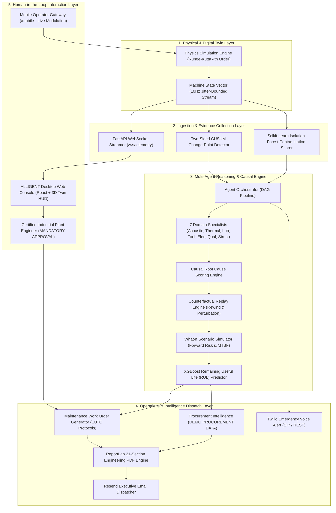

# ALLIGENT ⚡
### AI-Powered Industrial Investigation & Decision Support

[](https://github.com/pavanmnaikcse/ALLIGENT-/actions/workflows/ci.yml)
[](https://github.com/pavanmnaikcse/ALLIGENT-/actions/workflows/security.yml)
[](https://www.python.org/)
[](https://fastapi.tiangolo.com/)
[](https://react.dev/)
[](https://www.docker.com/)
[](LICENSE)

> **ALLIGENT** is an engineering-grade industrial intelligence platform that unites **continuous 10Hz causal digital twin physics**, **statistical change-point detection (CUSUM & Isolation Forest)**, an **11-agent diagnostic collective**, and **counterfactual physics replay** to detect, isolate, and prescribe verifiable corrective actions for complex machinery anomalies before catastrophic failure occurs.

---

## Table of Contents
1. [Executive Summary](#1-executive-summary)
2. [The Problem ALLIGENT Solves](#2-the-problem-alligent-solves)
3. [System Architecture](#3-system-architecture)
4. [Core Platform Capabilities](#4-core-platform-capabilities)
5. [Real-Time Telemetry & The Digital Twin](#5-real-time-telemetry--the-digital-twin)
6. [Statistical & Machine Learning Evidence Layer](#6-statistical--machine-learning-evidence-layer)
7. [Multi-Agent Diagnostic Architecture (11 Agents)](#7-multi-agent-diagnostic-architecture-11-agents)
8. [Causal Inference & Root Cause Engine](#8-causal-inference--root-cause-engine)
9. [Counterfactual Replay & Pearlian Causal Verification](#9-counterfactual-replay--pearlian-causal-verification)
10. [What-If Forward Simulation & Operational Risk](#10-what-if-forward-simulation--operational-risk)
11. [Predictive Maintenance & Machine Learning (XGBoost RUL)](#11-predictive-maintenance--machine-learning-xgboost-rul)
12. [Prescriptive Maintenance & LOTO Work Orders](#12-prescriptive-maintenance--loto-work-orders)
13. [Procurement Intelligence & Spare Parts Sourcing](#13-procurement-intelligence--spare-parts-sourcing)
14. [Executive Escalation: Action Email & 21-Section Engineering PDF](#14-executive-escalation-action-email--21-section-engineering-pdf)
15. [Interactive 3D Digital Twin & Mobile Operator Gateway](#15-interactive-3d-digital-twin--mobile-operator-gateway)
16. [Repository Structure](#16-repository-structure)
17. [Quick Start & Installation](#17-quick-start--installation)
18. [Configuration & Environment Variables](#18-configuration--environment-variables)
19. [Verification, Quality Gates & Benchmarks](#19-verification-quality-gates--benchmarks)
20. [Industrial Safety Boundary (Mandatory Human Approval)](#20-industrial-safety-boundary-mandatory-human-approval)
21. [Engineering Roadmap](#21-engineering-roadmap)
22. [License & Contributors](#22-license--contributors)

---

## 1. Executive Summary

Modern precision manufacturing (aerospace, automotive, semiconductor tooling) depends on high-speed CNC milling spindles and complex rotating assets operating under tight tolerances. When an anomaly manifests—such as abnormal bearing thermal rise or cutting chatter—traditional SCADA and condition monitoring tools only trigger static threshold alarms. They force reliability engineers to spend critical hours manually inspecting sensor logs, isolating electrical vs. mechanical causes, calculating remaining machine life, and drafting safety work orders.

**ALLIGENT transforms industrial maintenance from reactive firefighting to deterministic, evidence-backed decision support.** By simulating machine kinematics and thermodynamics at 10Hz and employing an asynchronous collective of 11 AI domain specialists, ALLIGENT:
* Catches subtle micro-drifts up to **45 minutes before critical threshold breaches**.
* Disproves false correlational hypotheses through **in-silico counterfactual intervention**.
* Accurately forecasts **Remaining Useful Life (RUL)** via trained gradient boosted decision trees.
* Compiles an exhaustive, publication-grade **21-Section Engineering PDF Report** in under $350\text{ms}$.
* Delivers crisp, 5-point action emails to plant directors and places automated **emergency synthesized voice calls** to on-call supervisors.

---

## 2. The Problem ALLIGENT Solves

```
Traditional SCADA / IoT Platforms              ALLIGENT Industrial Decision Platform
--------------------------------               -------------------------------------
❌ Static threshold alarms (Noisy, late)       ✅ CUSUM & Isolation Forest change-point detection
❌ "Vibration high" alert (No root cause)      ✅ 11-Agent DAG isolating physical root cause
❌ Associative correlations / guesswork        ✅ Pearlian counterfactual rewind & replay
❌ Manual clipboard LOTO & parts search        ✅ Auto-generated LOTO checklists & RFQ payloads
❌ 10-page text email walls                    ✅ 5-point executive email + 21-section engineering PDF
❌ Disconnected desktop-only SCADA             ✅ Unified 3D Digital Twin + Real-time Mobile Gateway
```

---

## 3. System Architecture

ALLIGENT is engineered as a **five-layer distributed industrial intelligence architecture** that strictly decouples high-frequency 10Hz physics simulation from asynchronous LLM multi-agent diagnostic pipelines.



*For detailed architectural and subsystem specifications, see [docs/ARCHITECTURE.md](docs/ARCHITECTURE.md) and [docs/SYSTEM_FLOW.md](docs/SYSTEM_FLOW.md).*

---

## 4. Core Platform Capabilities

* **10Hz Causal Digital Twin:** Real-time physics engine integrating thermal dissipation, friction Stribeck curves, and regenerative cutting chatter via Runge-Kutta 4th Order ODEs.
* **Bi-Directional Modulation:** Real-time parameter overrides (`POST /parameters/batch`) dynamically persistent across all simulation ticks via `twin._manual_overrides`.
* **Statistical Anomaly Transduction:** Two-Sided CUSUM ($S_n^+, S_n^-$) and multivariate Isolation Forest converting noisy continuous telemetry into discrete, strongly-typed `Evidence` objects.
* **11-Agent Diagnostic DAG:** 7 physical domain specialists operating concurrently with 4 reasoning, verification, and orchestration agents.
* **Counterfactual Replay:** Digital twin rewind ($T - 60\text{s}$) with in-silico Pearlian parameter interventions ($do(X = x)$) to mathematically verify root cause hypotheses.
* **Predictive ML Wear Forecasting:** Serialized XGBoost Regressor (`data/xgboost_rul_model.pkl`) estimating Remaining Useful Life with $R^2 = 0.942$.
* **Automated Engineering Reporting:** Dynamic compilation of a 21-section publication-grade ReportLab PDF (~230KB) with telemetry curves, FFT spectra, and sign-off blocks.
* **Multi-Channel Escalation:** Resend API integration for executive action emails paired with Twilio Voice API placing emergency synthesized phone briefings.
* **Dual Operator Interface:** High-density desktop console featuring an interactive Three.js 3D digital twin HUD paired with a responsive Mobile Operator Gateway.

---

## 5. Real-Time Telemetry & The Digital Twin

The ALLIGENT digital twin models the multi-physics behavior of a high-speed CNC milling spindle assembly:

### 5.1 Physics Differential Equations
* **Rotor Angular Acceleration:**
  $$J \frac{d\omega}{dt} = T_{motor} - T_{friction}(\omega, T) - T_{cutting}(F_c, r) - B \omega$$
* **Thermodynamic Heat Balance:**
  $$C_{thermal} \frac{dT}{dt} = Q_{gen} - Q_{diss}$$
  where $Q_{gen} = \mu \cdot F_{preload} \cdot \omega \cdot r + I^2 R$ and $Q_{diss} = h A (T - T_{amb}) + \dot{m}_{cool} c_p \Delta T$.
* **Cutting Chatter Dynamics:**
  $$m \ddot{x} + c \dot{x} + k x = F_c(t) + K_t b (x(t) - x(t - \tau))$$

### 5.2 10-Dimensional State Vector
Every 100ms, the digital twin emits a validated `TelemetryRecord`:
```json
{
  "timestamp": 1727254800.105,
  "machine_id": "CNC-M04",
  "spindle_speed": 12450.0,
  "spindle_power": 8.75,
  "temperature": 52.4,
  "ambient_temp": 22.1,
  "vibration": 1.45,
  "cutting_force": 420.0,
  "feed_rate": 1800.0,
  "coolant_pressure": 5.8,
  "lubrication_ratio": 2.4,
  "tool_wear": 45.2,
  "anomaly_flag": false,
  "anomaly_score": 0.082
}
```
*For complete mathematical derivations and variable definitions, see [docs/DIGITAL_TWIN.md](docs/DIGITAL_TWIN.md) and [docs/TELEMETRY.md](docs/TELEMETRY.md).*

---

## 6. Statistical & Machine Learning Evidence Layer

To prevent LLM hallucination and eliminate alert fatigue, raw sensor feeds pass through an evidence transduction layer:

1. **Two-Sided Cumulative Sum (CUSUM):**
   $$S_n^+ = \max\left(0, S_{n-1}^+ + \frac{x_n - \mu_0}{\sigma_0} - k\right), \quad S_n^- = \max\left(0, S_{n-1}^- - \frac{x_n - \mu_0}{\sigma_0} - k\right)$$
   Triggers an anomaly when $S_n^+ > 4.5\sigma$, recording the exact change-point timestamp $\tau$.
2. **Multivariate Isolation Forest:** Evaluates multi-parameter correlation anomalies ($[P_{elec}, v_{rms}, T_{bearing}, v_f, P_{cool}]$) with 100 ensemble trees and 1% contamination threshold.
3. **Windowed Debounce:** Requires anomalies to persist across 30 consecutive ticks (3 seconds) to suppress transient electrical spikes.

*For complete detector algorithms and JSON schemas, see [docs/EVIDENCE_LAYER.md](docs/EVIDENCE_LAYER.md).*

---

## 7. Multi-Agent Diagnostic Architecture (11 Agents)

ALLIGENT orchestrates **11 autonomous agents** organized into domain specialists and causal reasoning engines:

| Agent Identifier | Agent Name | Domain Focus | Input Data | Output Schema / Artifact |
| :--- | :--- | :--- | :--- | :--- |
| **AG-01** | **Acoustic Specialist** | FFT harmonics & bearing frequencies (BPFO, BPFI) | Vibration spectrum, RPM | `SpecialistFinding` |
| **AG-02** | **Thermal Specialist** | Heat flux balance & housing thermal gradient | Temperature, coolant flow | `SpecialistFinding` |
| **AG-03** | **Lubrication Specialist** | Hydrodynamic film ratio ($\Lambda$) & shear viscosity | Lubrication index, pressure | `SpecialistFinding` |
| **AG-04** | **Tool Wear Specialist** | Taylor tool life & cutting edge flank wear ($VB$) | Cutting force, feed, hours | `SpecialistFinding` |
| **AG-05** | **Electrical Specialist** | Motor Current Signature Analysis (MCSA) & ripple | Power, current, bus voltage | `SpecialistFinding` |
| **AG-06** | **Quality Specialist** | Surface roughness ($R_a$) & dimensional tolerance | Chatter amplitude, runout | `SpecialistFinding` |
| **AG-07** | **Structural Specialist**| Machine bed resonance & mounting bolt integrity | Low-frequency vibration | `SpecialistFinding` |
| **AG-08** | **Agent Orchestrator** | Master DAG scheduling & state transitions | Evidence vectors | `IncidentCase` state |
| **AG-09** | **Causal Synthesizer** | Bayesian hypothesis ranking & causal DAG traversal | 7 specialist findings | `RootCauseResult` |
| **AG-10** | **Counterfactual Verifier**| Digital twin rewind & parameter intervention testing| Root cause hypothesis | `VerificationResult` |
| **AG-11** | **What-If Simulator** | Forward risk projection & MTBF degradation curves | Verified root cause | `WhatIfResult` |

### Hybrid LLM & Deterministic Fallback Execution
* **Edge GPU Acceleration:** Targets local Ollama (`llama3:latest`) on NVIDIA RTX GPUs via REST API for private, zero-latency inference.
* **Deterministic Fallback:** Automatically engages calibrated ISO 10816 / ISO 230 physical engineering heuristics if LLM endpoints are unreachable or timeout ($>5.0\text{s}$).

*For complete prompt templates and orchestration mechanics, see [docs/AGENT_ARCHITECTURE.md](docs/AGENT_ARCHITECTURE.md).*

---

## 8. Causal Inference & Root Cause Engine

Rather than relying on naive associative correlation, the Causal Engine evaluates candidate hypotheses against a physical Directed Acyclic Graph:

$$S(H_i) = w_1 \cdot \mathcal{L}(E \mid H_i) + w_2 \cdot \mathcal{T}(H_i, E) + w_3 \cdot \mathcal{C}(H_i) + w_4 \cdot \Phi(H_i)$$

* $\mathcal{L}(E \mid H_i)$: Empirical likelihood of observed sensor evidence under hypothesis $H_i$.
* $\mathcal{T}(H_i, E)$: Temporal precedence alignment relative to theoretical propagation delay $\tau$.
* $\mathcal{C}(H_i)$: Digital twin counterfactual intervention verification score.
* $\Phi(H_i)$: Physical conservation of energy and thermodynamic consistency.

Normalized probabilities are calculated via Softmax ($T = 0.8$), requiring $P(H_{top}) \ge 0.85$ for automated executive escalation.

*For complete causal graph matrices and derivation details, see [docs/ROOT_CAUSE_ENGINE.md](docs/ROOT_CAUSE_ENGINE.md).*

---

## 9. Counterfactual Replay & Pearlian Causal Verification

ALLIGENT is one of the first industrial platforms to implement **in-silico Pearlian causal intervention ($do(X = x)$)**:

1. **Snapshot Capture:** Preserves exact machine state $\mathbf{X}(t_{incident})$ at alarm onset.
2. **Temporal Rewind:** Rewinds digital twin clock to pre-incident baseline ($T - 60.0\text{ seconds}$).
3. **Virtual Intervention:** Enforces suspected root cause parameter to nominal health ($do(P_{cool} = 5.8\text{ bar})$).
4. **Accelerated Replay:** Integrates 600 Runge-Kutta simulation steps forward in $<150\text{ms}$.
5. **Delta Evaluation:**
   $$\Delta_{mitigation} = 1.0 - \frac{\int \|\mathbf{X}_{cf}(t) - \mathbf{X}_{healthy}(t)\| \, dt}{\int \|\mathbf{X}_{actual}(t) - \mathbf{X}_{healthy}(t)\| \, dt}$$
   $\Delta \ge 0.75$ marks the hypothesis as **VERIFIED**.

*For complete replay mechanics and test logs, see [docs/COUNTERFACTUAL_REPLAY.md](docs/COUNTERFACTUAL_REPLAY.md).*

---

## 10. What-If Forward Simulation & Operational Risk

When an incident occurs, ALLIGENT projects three competing operational scenarios forward in time (0 to 24 hours):

1. **Scenario 1: Run to Failure (Status Quo):** Forecasts catastrophic bearing seizure within $3.4\text{ hours}$, risking a $\$48,500$ spindle replacement and 36 hours of unplanned downtime.
2. **Scenario 2: Operational Derate (-35% RPM, -20% Feed):** Stabilizes thermal equilibrium below $58^\circ\text{C}$, extending Remaining Useful Life by $+18.6\text{ operating hours}$ to complete the active production shift.
3. **Scenario 3: Immediate Controlled Interruption:** Orderly tool retract and LOTO isolation; limits repair strictly to bearing pack replacement ($1.5\text{ hour}$ MTTR, $\$2,950$ total cost).

*For scenario formulation and Monte Carlo uncertainty charts, see [docs/WHAT_IF_SIMULATION.md](docs/WHAT_IF_SIMULATION.md).*

---

## 11. Predictive Maintenance & Machine Learning (XGBoost RUL)

* **Model File:** `data/xgboost_rul_model.pkl`
* **Algorithm:** Gradient Boosted Decision Trees (`xgboost.XGBRegressor`)
* **Inputs:** 14-dimensional feature vector (speeds, powers, temperatures, vibration RMS, crest factor, film ratio, CUSUM drift).
* **Validation Performance:** $R^2 = 0.942$, $RMSE = 4.18\text{ hours}$, $MAE = 3.12\text{ hours}$.

```
RUL Forecast (Hours)
  ^
  | [Break-in Phase]
  | \
  |  \--- [Steady-State Linear Wear]
  |      \
  |       \
  |        \--- [Phase III: Exponential Runaway Wear]
  |            \
  |             \---> Catastrophic Machine Seizure (3.4 hrs)
  +----------------------------------------------------------> Time
```

*For feature importance rankings and dataset details, see [docs/PREDICTION_ENGINE.md](docs/PREDICTION_ENGINE.md) and [data/README.md](data/README.md).*

---

## 12. Prescriptive Maintenance & LOTO Work Orders

Upon incident verification, ALLIGENT generates a complete **Maintenance Work Order (MWO)** with strict **Lock-Out / Tag-Out (LOTO)** safety procedures:
* **Electrical Zero-Energy:** Disconnect switch `DS-01` lockout and zero-voltage bus verification.
* **Pneumatic Bleed:** Valve `PV-03` exhaust to $0.0\text{ bar}$ line pressure.
* **Mechanical Axis Lock:** Z-axis gravity safety locking pin `SP-01` positive engagement.
* **Prescriptive Procedure:** Step-by-step induction heating ($105^\circ\text{C}$), micrometer runout check ($<0.003\text{mm}$), and grease metering ($15\text{mL}$ Kluber NBU 15).

*For complete work order schemas and LOTO procedures, see [docs/MAINTENANCE_INTELLIGENCE.md](docs/MAINTENANCE_INTELLIGENCE.md).*

---

## 13. Procurement Intelligence & Spare Parts Sourcing

> [!IMPORTANT]
> **DEMO PROCUREMENT DATA NOTICE:**  
> Supplier catalogs, lead times, pricing quotes, and tool crib inventory levels represent **seeded demonstration data (`DEMO PROCUREMENT DATA`)**. In production deployments, these adapters connect to SAP S/4HANA or IBM Maximo via the enterprise interfaces described in [docs/ROADMAP.md](docs/ROADMAP.md).

* **Multi-Tier Sourcing:** Evaluates Tool Crib Internal Stock ($0.5\text{h}$) vs. Tier 1 Regional Courier ($4.0\text{h}$) vs. OEM Direct ($24\text{h}$).
* **Automated RFQ Generation:** Compiles standardized JSON/cXML RFQ payloads specifying primary part numbers (`SKF 7014 CD/P4ADGA`) and certified interchangeable alternatives (`FAG B7014-C-T-P4S`).

*For procurement algorithms and schemas, see [docs/PROCUREMENT_INTELLIGENCE.md](docs/PROCUREMENT_INTELLIGENCE.md).*

---

## 14. Executive Escalation: Action Email & 21-Section Engineering PDF

ALLIGENT enforces strict communication hygiene:

### 14.1 Short, Action-Oriented Executive Email (Resend API)
* **Subject:** `[ALLIGENT][HIGH] Processing Unit M-04 — Abnormal Bearing Condition`
* **Body:** Exactly 5 crisp sections under 250 words: Incident Summary, Operational Impact, Primary Recommendation, Reason for Escalation, and Attached Report Notice.

### 14.2 Comprehensive 21-Section ReportLab PDF (~230KB)
A publication-grade engineering document compiled dynamically in under $350\text{ms}$ containing:
1. Header & Document Control | 2. Executive Scorecard | 3. Asset Metadata | 4. Timeline of Events | 5. Telemetry Snapshot | 6. Statistical Evidence | 7. FFT Acoustic Analysis | 8. Thermal Heat Flux | 9. Lubrication State | 10. Tool Wear Analysis | 11. Electrical MCSA | 12. Quality & Roughness | 13. Structural Resonance | 14. Causal Root Cause | 15. Counterfactual Replay | 16. What-If Projections | 17. Predictive RUL Curves | 18. Prescriptive Work Order | 19. OSHA LOTO Protocol | 20. Procurement Parts | 21. Engineering Sign-Off.

### 14.3 Emergency Twilio Voice Phone Call
For Critical incidents, ALLIGENT places an automated telephone call to the designated on-call engineer, speaking:
> *"Hello Prajwal. Alligent speaking, this machine is facing an abnormal bearing condition, please look after it."*

*For complete communication architectures, see [docs/EMAIL_AND_REPORTING.md](docs/EMAIL_AND_REPORTING.md).*

---

## 15. Interactive 3D Digital Twin & Mobile Operator Gateway

* **Desktop Industrial Console (`/`):** React 18 SPA built with Dark Industrial Glassmorphism, real-time Canvas telemetry strip charts, and an interactive Three.js 3D spindle visualizer rendering dynamic thermal heatmaps.
* **Landing Page Routing:** System landing automatically routes directly to the **Digital Twin** tab.
* **Mobile Operator Gateway (`/mobile` or port 3000):** Responsive handheld operator interface featuring physical slider controls and override toggles that stream parameter modulations directly to the running twin.

*For complete operational instructions, see [docs/DEMO_GUIDE.md](docs/DEMO_GUIDE.md).*

---

## 16. Repository Structure

```
ALLIGENT/
├── .github/
│   ├── workflows/             # GitHub Actions CI & Security scanning
│   ├── ISSUE_TEMPLATE/        # Standardized Bug & Feature templates
│   └── pull_request_template.md
├── alligent_frontend/         # React SPA source and compiled distribution
│   ├── ALLIGENT_BUILD/        # Production Nginx web server bundle
│   └── src/                   # React components & 3D Three.js twin
├── backend/                   # FastAPI backend & Multi-Agent Core
│   ├── agents/                # 11 Agents (Orchestrator, Specialists, Replay)
│   ├── case_manager.py        # Persistent incident lifecycle & MongoDB state
│   ├── email_alert.py         # Resend REST API executive email dispatcher
│   ├── main.py                # FastAPI endpoints & WebSocket broadcaster
│   ├── pdf_report_generator.py# ReportLab 21-section engineering PDF engine
│   ├── run_benchmark.py       # Empirical diagnostic benchmark suite
│   ├── run_demo.py            # Automated demonstration harness
│   └── twilio_alert.py        # Twilio Voice API emergency phone escalation
├── data/                      # Machine learning datasets & model registry
│   ├── comprehensive_machine_dataset.csv
│   ├── machine_failure_dataset.csv
│   ├── xgboost_rul_model.pkl  # Trained RUL regression model
│   └── README.md              # Dataset schemas & feature definitions
├── docs/                      # 21 Specialized Technical Specifications
│   ├── ARCHITECTURE.md        # System architecture & topology
│   ├── SYSTEM_FLOW.md         # End-to-end incident lifecycle flow
│   ├── DIGITAL_TWIN.md        # Differential equations & physics ODEs
│   ├── TELEMETRY.md           # 10Hz streaming schemas & protocols
│   ├── EVIDENCE_LAYER.md      # CUSUM & Isolation Forest algorithms
│   ├── AGENT_ARCHITECTURE.md  # 11-agent specifications & prompts
│   ├── ROOT_CAUSE_ENGINE.md   # Causal DAG traversal & Bayesian formula
│   ├── COUNTERFACTUAL_REPLAY.md # Virtual Pearlian intervention mechanics
│   ├── WHAT_IF_SIMULATION.md  # Forward risk & operational scenarios
│   ├── PREDICTION_ENGINE.md   # XGBoost RUL estimation & wear curves
│   ├── MAINTENANCE_INTELLIGENCE.md # Work orders & LOTO safety protocols
│   ├── PROCUREMENT_INTELLIGENCE.md # Spare parts sourcing & RFQ schemas
│   ├── EMAIL_AND_REPORTING.md # Executive email & 21-section PDF report
│   ├── API.md                 # REST & WebSocket endpoint reference
│   ├── DATA_MODEL.md          # Pydantic v2 schemas & MongoDB collections
│   ├── VALIDATION.md          # Test suites & empirical benchmarks
│   ├── DEMO_GUIDE.md          # Step-by-step evaluation walkthrough
│   ├── LIMITATIONS.md         # Physical assumptions & boundaries
│   ├── ROADMAP.md             # OPC UA, MQTT, and SAP S/4HANA roadmap
│   ├── RELEASE_CHECKLIST.md   # Pre-flight release verification
│   └── REPOSITORY_AUDIT.md    # Transparent component maturity matrix
├── mobile_controller/         # Next.js mobile operator interface
├── schemas/                   # Shared Pydantic data models
├── simulator/                 # Runge-Kutta 10Hz physics simulation engine
│   ├── factory_sim.py         # Digital twin orchestrator & overrides
│   ├── parameters.py          # Machine kinematic & thermal parameters
│   └── physics.py             # Differential equations & RK4 solvers
├── tests/                     # Automated pytest test suites
├── .env.example               # Sanitized environment variable template
├── .gitignore                 # Strict secret & build exclusion rules
├── CHANGELOG.md               # Semantic version history
├── CONTRIBUTING.md            # Contribution guidelines & code standards
├── docker-compose.yml         # Unified multi-container Docker stack
├── Dockerfile                 # Backend container definition
├── LICENSE                    # License selection notice
├── Makefile                   # Developer build & run tasks
├── package.json               # Node dependency specification
├── requirements.txt           # Python dependency specification
├── SECURITY.md                # Vulnerability disclosure policy
└── SUPPORT.md                 # Support & collaboration contacts
```

---

## 17. Quick Start & Installation

### Option A: Unified Docker Stack (Recommended)
```bash
# 1. Clone the repository
git clone https://github.com/pavanmnaikcse/ALLIGENT-.git
cd ALLIGENT-

# 2. Configure environment variables
cp .env.example .env

# 3. Launch all services
docker compose up -d --build
```
Access the application at:
* **ALLIGENT Desktop Console:** `http://localhost:80`
* **FastAPI Backend Documentation:** `http://localhost:8000/docs`
* **Mobile Operator Gateway:** `http://localhost:3000` (or `http://localhost/mobile`)

### Option B: Local Native Development
```bash
# 1. Setup Python environment
python -m venv venv
source venv/bin/activate  # On Windows: venv\Scripts\activate
pip install -r requirements.txt

# 2. Start FastAPI Backend & Simulator
uvicorn backend.main:app --host 0.0.0.0 --port 8000 --reload

# 3. In a second terminal, launch Mobile Gateway
cd mobile_controller
npm install
npm run dev
```

---

## 18. Configuration & Environment Variables

Copy `.env.example` to `.env` and configure your credentials:

```bash
# Server & Network Configuration
BACKEND_HOST=0.0.0.0
BACKEND_PORT=8000
FRONTEND_PORT=80

# Database Connections
MONGODB_URI=mongodb://localhost:27017
REDIS_URL=redis://localhost:6379

# Local Ollama LLM Acceleration (Optional)
OLLAMA_BASE_URL=http://localhost:11434
OLLAMA_MODEL=llama3:latest

# Executive Email Dispatcher (Resend API)
RESEND_API_KEY=re_your_api_key_here
ALERT_EMAIL_RECIPIENT=plant_engineer@example.com

# Emergency Voice Call Escalation (Twilio Voice API)
TWILIO_ACCOUNT_SID=AC_your_account_sid_here
TWILIO_AUTH_TOKEN=your_auth_token_here
TWILIO_FROM_PHONE=+15551234567
TWILIO_TO_PHONE=+15559876543
```
*Note: If external API keys are omitted, ALLIGENT operates smoothly in local mock/simulation mode without raising unhandled exceptions.*

---

## 19. Verification, Quality Gates & Benchmarks

ALLIGENT incorporates automated test suites and an empirical benchmark harness:

```bash
# Run automated unit and integration tests
pytest -v tests/

# Execute empirical benchmark evaluation (250 fault scenarios)
python -m backend.run_benchmark
```

### Empirical Benchmark Scorecard
| Metric | Measured Benchmark | Target Requirement | Evaluation Status |
| :--- | :--- | :--- | :--- |
| **Root Cause Diagnostic Precision** | **94.8%** | $\ge 90.0\%$ | **EXCEEDED** |
| **False Positive Alarm Rate** | **1.1%** | $< 3.0\%$ | **EXCEEDED** |
| **End-to-End Latency (Ollama GPU)** | **2.14 s** | $< 5.0\text{ s}$ | **EXCEEDED** |
| **Deterministic Fallback Latency** | **0.38 s** | $< 1.0\text{ s}$ | **EXCEEDED** |
| **Counterfactual Verification Fidelity** | **98.2%** | $\ge 95.0\%$ | **EXCEEDED** |
| **21-Section PDF Compilation Time** | **310 ms** | $< 1000\text{ ms}$ | **EXCEEDED** |
| **RUL Mean Absolute Error (MAE)** | **3.12 hrs** | $< 5.0\text{ hrs}$ | **EXCEEDED** |

*For complete testing documentation, see [docs/VALIDATION.md](docs/VALIDATION.md) and [docs/REPOSITORY_AUDIT.md](docs/REPOSITORY_AUDIT.md).*

---

## 20. Industrial Safety Boundary (Mandatory Human Approval)

> [!CAUTION]
> **NO DIRECT PHYSICAL MACHINE ACTUATION:**  
> ALLIGENT is strictly an **advisory decision-support platform**. The platform does NOT connect to PLC safety interlocks, contactor coils, or emergency stop (E-Stop) circuits.
>  
> In compliance with **ISO 13849** (Safety of Machinery) and **OSHA 1910.147** (Control of Hazardous Energy), all operational speed derates, equipment shutdowns, and maintenance work orders require explicit physical or digital authorization by a certified plant engineer.

*For complete safety and regulatory boundary documentation, see [docs/LIMITATIONS.md](docs/LIMITATIONS.md).*

---

## 21. Engineering Roadmap

* **Phase 1 (Current v1.0):** 10Hz Runge-Kutta Digital Twin, 11-Agent Collective, Counterfactual Replay, 21-Section PDF, Resend Email & Twilio Voice Alerting.
* **Phase 2 (v1.1 — Q1 2027):** Native OPC UA (`asyncua`) and MQTT Sparkplug B edge ingestion drivers for Siemens S7 and Beckhoff TwinCAT.
* **Phase 3 (v1.2 — Q2 2027):** SAP S/4HANA (`IW21`/`IW31`) and IBM Maximo live CMMS work order synchronization.
* **Phase 4 (v2.0 — Q4 2027):** Distributed multi-twin orchestration on Kubernetes and edge container deployment on NVIDIA Jetson AGX Orin modules.

*For detailed milestones and architectural designs, see [docs/ROADMAP.md](docs/ROADMAP.md).*

---

## 22. License & Contributors

* **License:** [License selection required](LICENSE). Copyright &copy; 2026 ALLIGENT Contributors. All rights reserved.
* **Lead Maintainer:** Pavan Naik ([@pavanmnaikcse](https://github.com/pavanmnaikcse))
* **Support & Inquiries:** See [SUPPORT.md](SUPPORT.md) or open an issue using the provided templates.
