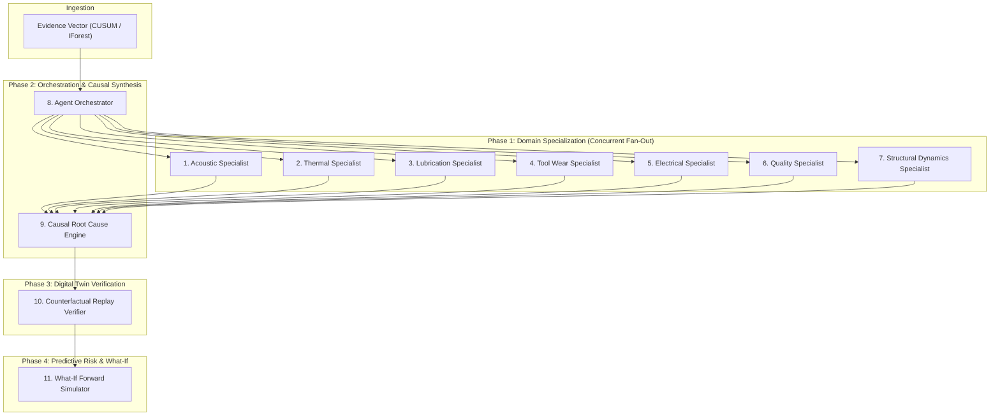
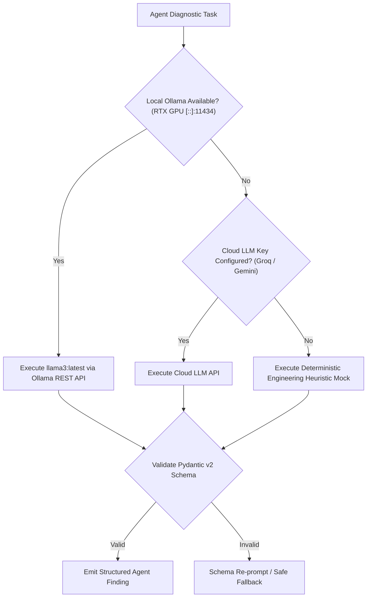

# ALLIGENT Multi-Agent Intelligence Architecture

**Product:** ALLIGENT — AI-Powered Industrial Investigation & Decision Support  
**Document:** Multi-Agent Specification & Orchestration Topology  
**Version:** 1.0.0  

---

## 1. Overview of the 11-Agent Architecture

ALLIGENT employs an asynchronous, graph-orchestrated multi-agent collective comprising **11 specialized agents**:
* **7 Domain Specialists:** Fine-grained physical diagnostic experts.
* **4 Reasoning & Verification Agents:** Orchestration, causal synthesis, physics simulation replay, and forward risk projection.

---

## 2. Comprehensive Agent Specification Table

| Agent ID | Agent Name | Domain Focus | Input Data | Output Schema / Artifact | Primary Model / Fallback |
| :--- | :--- | :--- | :--- | :--- | :--- |
| **AG-01** | **Acoustic Specialist** | High-frequency vibration, FFT harmonics, bearing defect frequencies (BPFO, BPFI, BSF, FTF). | $v_{rms}$, FFT spectra, spindle RPM. | `SpecialistFinding` (Hypothesis, Confidence, Harmonic Peaks). | `llama3:latest` (Ollama) / Heuristic FFT Mock |
| **AG-02** | **Thermal Specialist** | Thermodynamic heat balance, thermal expansion, gradient drift across spindle housing. | $T_{bearing}$, $T_{amb}$, $dT/dt$, coolant flow. | `SpecialistFinding` (Heat Flux Balance, Dissipation Deficit). | `llama3:latest` (Ollama) / Thermal ODE Mock |
| **AG-03** | **Lubrication Specialist** | Hydrodynamic oil film thickness ($\Lambda$), viscosity shear, oil starvation, seal leaks. | Lubrication ratio $\Lambda$, pump pressure, viscosity. | `SpecialistFinding` (Film Breakdown Risk, Viscosity Index). | `llama3:latest` (Ollama) / Stribeck Curve Mock |
| **AG-04** | **Tool Wear Specialist** | Taylor tool life ($VB$), cutting edge micro-chipping, tool breakage prediction. | $F_c$, feed velocity, cutting hours, tool grade. | `SpecialistFinding` (Flank Wear Land, Breakage Probability).| `llama3:latest` (Ollama) / Taylor Tool Model |
| **AG-05** | **Electrical Specialist** | Motor Current Signature Analysis (MCSA), stator winding resistance, drive inverter torque ripple. | $P_{elec}$, drive frequency, phase current, bus voltage. | `SpecialistFinding` (Current Ripple, Stator Thermal Load). | `llama3:latest` (Ollama) / MCSA Harmonic Mock |
| **AG-06** | **Quality Specialist** | Finished part surface roughness ($R_a$), dimensional tolerance drift, tool deflection. | Cutting chatter amplitude, tool runout, spindle speed. | `SpecialistFinding` (Surface Roughness $R_a$, Scrap Risk).| `llama3:latest` (Ollama) / Roughness Formula Mock |
| **AG-07** | **Structural Specialist** | Machine tool bed resonance, loose anchor bolts, structural natural frequencies ($f_n$). | Low-frequency accelerometer data ($0.5-50\text{Hz}$). | `SpecialistFinding` (Modal Resonance, Loose Mounting Score).| `llama3:latest` (Ollama) / Modal Analysis Mock |
| **AG-08** | **Agent Orchestrator** | Master DAG scheduling, message routing, timeout handling, cross-specialist debate control. | Evidence vector, system incident trigger. | `IncidentCase` lifecycle state transitions. | Deterministic Python Orchestrator |
| **AG-09** | **Causal Root Cause Synthesizer**| Multi-hypothesis Bayesian weighting, temporal precedence filtering, causal graph traversal. | 7 specialist findings, historical incident DB. | `RootCauseResult` (Ranked Hypotheses, Likelihood, Causal Path). | `llama3:latest` (Ollama) / Bayesian Network Engine |
| **AG-10** | **Counterfactual Replay Verifier**| Simulator rewinding ($T-60\text{s}$), parameter intervention testing, delta verification. | Top root cause hypothesis, state snapshot. | `VerificationResult` (Hypothesis Verified/Falsified, $\Delta$ Metric).| Deterministic Physics Twin Engine |
| **AG-11** | **What-If Forward Simulator** | Forward failure trajectory, secondary component damage risk, MTBF degradation curve. | Verified root cause, current operating envelope. | `WhatIfResult` (Predicted MTBF, Secondary Failure Probability).| XGBoost Model + Monte Carlo Simulator |

---

## 3. LLM Routing & Fallback Architecture

To ensure high availability in air-gapped industrial plants while leveraging hardware acceleration when available:

### 3.1 Hardware Acceleration (Local Ollama)
When running on edge industrial workstations (e.g., equipped with NVIDIA RTX 4050/3060/4090 GPUs), ALLIGENT targets the local Ollama daemon on port 11434 (`http://localhost:11434/api/generate`). This provides:
* **Zero External Data Exfiltration:** All telemetry, machine names, and defect logs remain on-premise.
* **Low Latency:** Average inference latency of $1.2\text{s} - 2.8\text{s}$ per agent.
* **Cost Predictability:** Zero per-token API charges.

### 3.2 Deterministic Engineering Fallback
If neither local Ollama nor cloud LLM endpoints respond within $5.0\text{ seconds}$, the agent pipeline does not crash. It automatically engages calibrated **physics and domain heuristics** (e.g., standard ISO 10816 vibration severity charts and ISO 230 spindle temperature rules) to return valid, mathematically sound diagnostic outputs.
