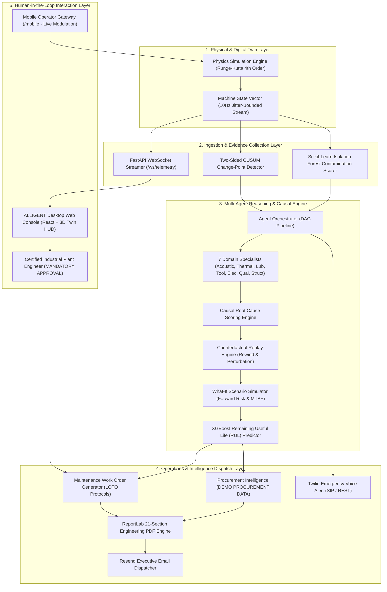

# ALLIGENT System Architecture

**Product:** ALLIGENT — AI-Powered Industrial Investigation & Decision Support  
**Document:** System Architecture & Topology Specification  
**Version:** 1.0.0  

---

## 1. Architectural Overview

**ALLIGENT** is structured as a **five-layer distributed industrial intelligence architecture** designed to bridge physical machine dynamics with multi-agent reasoning, predictive ML, and executive action workflows.

The system decouples **10Hz high-frequency physics execution** from **asynchronous multi-agent diagnostic pipelines**, ensuring that telemetry streaming, real-time visualization, and operator control remain fluid and uninterrupted even during compute-intensive LLM reasoning cycles.

---

## 2. Layered Component Breakdown

### 2.1 Layer 1: Physical & Digital Twin Simulation
* **Module:** `simulator/physics.py`, `simulator/factory_sim.py`, `simulator/parameters.py`
* **Role:** Models continuous real-world CNC milling dynamics using physical differential equations. It tracks spindle rotational speed ($\omega$), motor power consumption ($P_{elec}$), bearing frictional heat generation ($Q_{gen}$), thermal dissipation ($Q_{diss}$), vibration velocity RMS ($v_{rms}$), and coolant fluid delivery ($P_{cool}$).
* **Frequency:** Integrates ODEs at a deterministic 10Hz (100ms tick interval), injecting Gaussian sensor noise and dynamic load anomalies.
* **Modulation Interface:** Exposes real-time state overrides via `twin._manual_overrides`, allowing operators to modulate cutting feed, tool wear, and coolant pressure from mobile and web interfaces.

### 2.2 Layer 2: Ingestion, Anomaly Scoring & Evidence Generation
* **Module:** `backend/main.py`, `backend/agents/stubs.py`, `backend/ingestion/`
* **Role:** Subscribes to the raw telemetry stream and extracts high-confidence statistical anomalies.
* **Detectors:**
  1. **Two-Sided CUSUM ($S_n^+, S_n^-$):** Detects abrupt structural mean shifts in spindle bearing temperatures and vibration RMS.
  2. **Isolation Forest:** Multi-dimensional ensemble anomaly detection scoring outliers across normalized load, vibration, and feed rate vectors.
* **Evidence Objects:** High-deviation events are packaged into strongly-typed `Evidence` structures containing timestamp, sensor identifier, observed value, baseline value, standard deviation, and anomaly confidence score ($z$-score).

### 2.3 Layer 3: Multi-Agent Reasoning & Causal Engine
* **Module:** `backend/agents/orchestrator.py`, `backend/agents/llm_specialists.py`, `backend/agents/verifier_replay.py`
* **Role:** Orchestrates 11 distinct AI agents in a strictly controlled 4-phase Directed Acyclic Graph (DAG):
  * **Phase 1: Domain Analysis:** 7 specialized agents analyze acoustic frequency signatures, thermal expansion, hydrodynamic film thickness, tool wear index, electrical harmonics, surface roughness, and structural resonance.
  * **Phase 2: Root Cause Synthesis:** Aggregates specialist findings, resolves conflicting hypotheses, applies temporal precedence rules, and computes normalized likelihood scores.
  * **Phase 3: Counterfactual Replay:** Rewinds simulator state to pre-incident conditions ($T - 60s$), replaces suspected root-cause parameters with nominal values, and simulates forward to verify whether the failure disappears.
  * **Phase 4: Predictive Assessment:** Projects secondary failure risks and queries the trained XGBoost model (`data/xgboost_rul_model.pkl`) for Remaining Useful Life (RUL) degradation curves.

### 2.4 Layer 4: Operations & Intelligence Dispatch
* **Module:** `backend/pdf_report_generator.py`, `backend/email_alert.py`, `backend/twilio_alert.py`
* **Role:** Transforms engineering diagnoses into actionable enterprise artifacts:
  * **21-Section ReportLab PDF:** Generates a comprehensive, publication-grade engineering PDF report (~230KB) complete with executive summaries, telemetry charts, fault tree diagrams, BOM part numbers, and sign-off blocks.
  * **Executive Action Email:** Formats a concise, non-bloated executive email briefing containing incident severity, financial risk, immediate containment steps, and the attached 21-section PDF report.
  * **Twilio Emergency Voice Alert:** Initiates an automated voice phone call to plant supervisors for Critical-severity incidents, audibly briefing the engineer on the fault and requesting immediate containment.

### 2.5 Layer 5: Human-in-the-Loop Interaction & Safety Boundary
* **Module:** `alligent_frontend/`, `mobile_controller/`
* **Role:** Provides high-density, real-time visualization and operator decision interfaces.
* **Industrial Safety Boundary:** ALLIGENT enforces a strict read-only boundary over physical actuation. While operators can adjust simulation parameters in the digital twin environment, physical machine modifications require authenticated human sign-off on the generated maintenance work orders.
