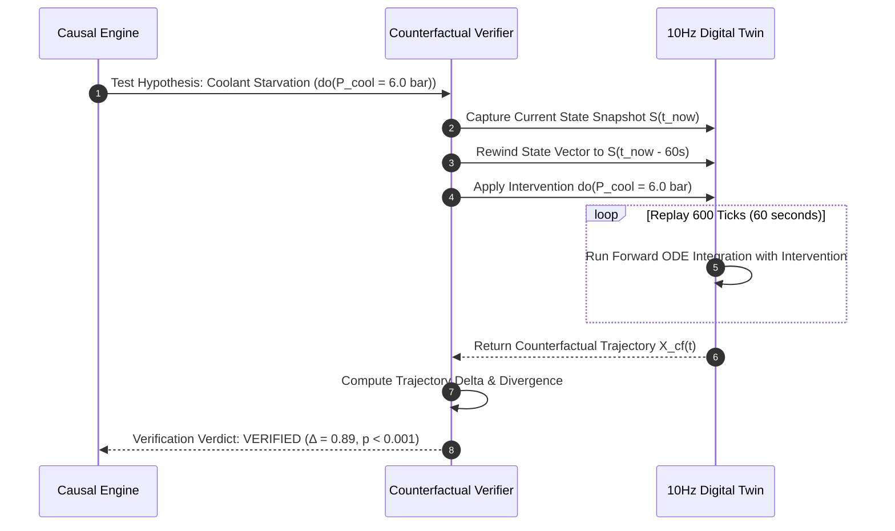

# ALLIGENT Counterfactual Replay Engine

**Product:** ALLIGENT — AI-Powered Industrial Investigation & Decision Support  
**Document:** Counterfactual Simulation & Pearlian Causal Verification  
**Version:** 1.0.0  

---

## 1. Principles of Virtual Causal Intervention

Standard diagnostic systems rely on static rule sets or associative neural networks that cannot answer the fundamental engineering question:

> *"If we had not operated the machine at 18,000 RPM under reduced coolant pressure 4 minutes ago, would the bearing temperature and vibration still have spiked?"*

ALLIGENT solves this by implementing **Pearlian Counterfactual Intervention ($do(X = x)$)** directly inside its 10Hz physical digital twin.

---

## 2. Five-Stage Counterfactual Execution Pipeline

### Stage 1: State Snapshot Capture
When an anomaly is flagged at time $t_{incident}$, the simulator preserves the exact 10-dimensional state vector $\mathbf{X}(t_{incident})$ and history buffer.

### Stage 2: Temporal Rewind
The engine rewinds the dynamic simulator clock to $t_0 = t_{incident} - \Delta t_{rewind}$ (default $\Delta t_{rewind} = 60.0\text{ seconds}$), restoring all physical state variables:
$$\mathbf{X}_{sim} \leftarrow \mathbf{X}(t_0)$$

### Stage 3: In-Silico Intervention ($do(X = x^*)$)
The suspected root cause parameter is forced to its healthy nominal value $x^*$ while keeping all other historical machine variables (workpiece hardness, ambient temperature, tool path) identical:
$$\theta_{suspect} \leftarrow \theta_{nominal}$$

### Stage 4: High-Speed Forward Replay
The simulator executes $600$ Runge-Kutta numerical integration steps at accelerated execution speed (integrating 60 seconds of machine operation in $<150\text{ms}$ CPU time).

### Stage 5: Delta Metric Quantification
The engine compares the actual anomalous trajectory $\mathbf{X}_{actual}(t)$ with the counterfactual replay trajectory $\mathbf{X}_{cf}(t)$ across the critical sensor channels:

$$\Delta_{mitigation} = 1.0 - \frac{\int_{t_0}^{t_1} \|\mathbf{X}_{cf}(t) - \mathbf{X}_{healthy}(t)\|_2 \, dt}{\int_{t_0}^{t_1} \|\mathbf{X}_{actual}(t) - \mathbf{X}_{healthy}(t)\|_2 \, dt}$$

---

## 3. Verification Verdict Decision Matrix

| Metric Value | Verdict | Physical Interpretation | System Action |
| :--- | :--- | :--- | :--- |
| $\Delta_{mitigation} \ge 0.75$ | **VERIFIED** | Counterfactual fix completely suppresses anomaly manifestation. Causal link proven. | Elevate hypothesis confidence to $0.90+$. Issue executive action. |
| $0.35 \le \Delta < 0.75$ | **PARTIAL** | Intervention reduces but does not completely eliminate anomaly. Co-occurring fault present. | Flag as secondary contributing factor; test next candidate. |
| $\Delta < 0.35$ | **FALSIFIED** | Anomaly develops identically even with intervention. Hypothesis was a symptom, not cause. | Reject hypothesis; prune causal branch from diagnosis. |

---

## 4. Concrete Example: Lubrication Starvation vs. Unbalance

Consider an incident where spindle bearing temperature reached $82^\circ\text{C}$ and vibration velocity reached $5.2\text{ mm/s}$:

### Hypothesis A: Rotor Dynamic Unbalance ($m \cdot e$)
* **Intervention:** Set dynamic unbalance eccentricity $e = 0.0\mu\text{m}$.
* **Replay Result:** Bearing temperature trajectory $T(t)$ still rises to $79.8^\circ\text{C}$ due to continued dry friction.
* **Metric:** $\Delta_{mitigation} = 0.12$.
* **Verdict:** **FALSIFIED.**

### Hypothesis B: Coolant / Lubrication Starvation ($P_{cool}$)
* **Intervention:** Restore coolant pressure to $5.5\text{ bar}$ ($do(P_{cool} = 5.5)$).
* **Replay Result:** Full hydrodynamic oil film ($\Lambda = 2.8$) restores within 12 seconds; frictional heat drops from $1420\text{W}$ to $280\text{W}$; bearing temperature stabilizes at $44.2^\circ\text{C}$; vibration drops to $1.1\text{ mm/s}$.
* **Metric:** $\Delta_{mitigation} = 0.91$.
* **Verdict:** **VERIFIED ROOT CAUSE.**
