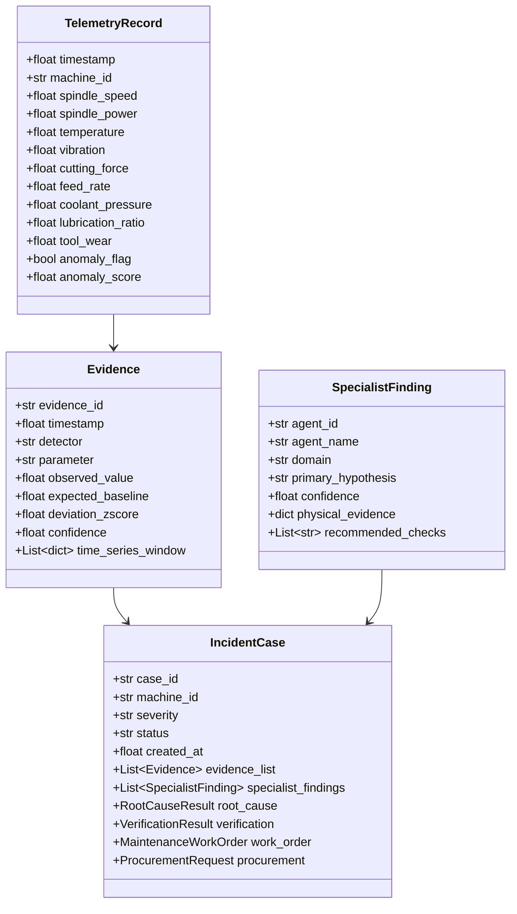

# ALLIGENT Data Model & Database Architecture

**Product:** ALLIGENT — AI-Powered Industrial Investigation & Decision Support  
**Document:** Data Schemas, Pydantic Models & Storage Architecture  
**Version:** 1.0.0  

---

## 1. Core Data Flow & Model Hierarchy

ALLIGENT employs strongly-typed **Pydantic v2** models throughout its ingestion, orchestration, and persistence layers. This guarantees strict structural validation across both Python backend services and MongoDB JSON document storage.



---

## 2. Pydantic v2 Class Definitions

### 2.1 TelemetryRecord (`schemas/telemetry.py`)
```python
from pydantic import BaseModel, Field

class TelemetryRecord(BaseModel):
    timestamp: float = Field(..., description="UTC Unix timestamp in seconds")
    machine_id: str = Field(default="CNC-M04", description="Unique machine asset tag")
    line_id: str = Field(default="LINE-02", description="Production line identifier")
    spindle_speed: float = Field(..., ge=0.0, le=30000.0, description="RPM")
    spindle_power: float = Field(..., ge=0.0, le=50.0, description="Motor power in kW")
    temperature: float = Field(..., ge=-20.0, le=200.0, description="Bearing temp in °C")
    ambient_temp: float = Field(default=22.0, description="Shop ambient temp in °C")
    vibration: float = Field(..., ge=0.0, le=50.0, description="Velocity RMS in mm/s")
    cutting_force: float = Field(..., ge=0.0, le=10000.0, description="Cutting force in N")
    feed_rate: float = Field(..., ge=0.0, le=10000.0, description="Axis feed in mm/min")
    coolant_pressure: float = Field(..., ge=0.0, le=20.0, description="Coolant pressure in bar")
    lubrication_ratio: float = Field(..., ge=0.0, le=10.0, description="Film ratio Lambda")
    tool_wear: float = Field(..., ge=0.0, le=2000.0, description="Flank wear in micrometers")
    anomaly_flag: bool = Field(default=False)
    anomaly_score: float = Field(default=0.0, ge=0.0, le=1.0)
```

### 2.2 RootCauseResult & HypothesisScore (`schemas/investigation.py`)
```python
from typing import List, Optional
from pydantic import BaseModel, Field

class HypothesisScore(BaseModel):
    hypothesis_id: str
    hypothesis_name: str
    description: str
    raw_score: float
    normalized_score: float = Field(..., ge=0.0, le=1.0)
    temporal_precedence: float
    physical_consistency: float
    causal_path: List[str]

class RootCauseResult(BaseModel):
    incident_id: str
    timestamp: float
    primary_hypothesis: HypothesisScore
    ranked_hypotheses: List[HypothesisScore]
    conflict_resolution_notes: Optional[str] = None
```

---

## 3. MongoDB Database Architecture & Collections

ALLIGENT utilizes **MongoDB 7.0** as its primary persistence backend, paired with **Redis 7.4** for high-frequency caching and session states.

### 3.1 Collections & Schema Design

#### 1. `telemetry_stream` (Capped Collection)
* **Purpose:** Stores the sliding window of raw 10Hz telemetry for post-incident playback and FFT recalculation.
* **Storage Engine:** Pre-allocated Capped Collection ($256\text{MB}$ capacity, holds $\approx 250,000$ telemetry frames).
* **Index:** `{"timestamp": 1}`

#### 2. `incident_cases` (Document Collection)
* **Purpose:** Stores the full lifecycle of every investigated anomaly.
* **Indexes:**
  * `{"case_id": 1}` (Unique)
  * `{"machine_id": 1, "created_at": -1}` (Compound for machine timeline lookup)
  * `{"status": 1}` (Active cases: `INVESTIGATING`, `ESCALATED`, `CONTAINED`, `CLOSED`)
  * `{"severity": 1}` (`LOW`, `MEDIUM`, `HIGH`, `CRITICAL`)

#### 3. `audit_logs` (Immutable Compliance Collection)
* **Purpose:** Records human sign-offs, parameter override injections, and emergency escalations for ISO 9001 / OSHA audit compliance.
* **TTL Policy:** Expired automatically after 365 days via `expireAfterSeconds: 31536000`.

---

## 4. In-Memory Graceful Fallback

In air-gapped field testing environments or initial Docker bootstrapping where MongoDB may be temporarily offline:
* `backend/case_manager.py` implements an **in-memory thread-safe dictionary fallback** (`self._in_memory_cases`).
* All investigation cases, generated work orders, and PDF reports remain fully functional and downloadable via API without crashing the server.
