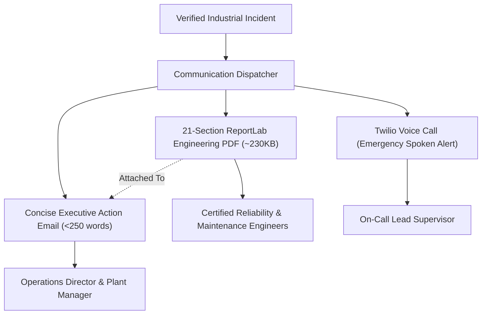

# ALLIGENT Incident Email & 21-Section Engineering PDF

**Product:** ALLIGENT — AI-Powered Industrial Investigation & Decision Support  
**Document:** Executive Notification & Engineering PDF Report Architecture  
**Version:** 1.0.0  

---

## 1. Core Communication Philosophy

Effective industrial incident escalation demands a strict separation between **executive communication** and **engineering evidence**:

> **The Email must be Short, Clear, and Action-Oriented.**  
> Plant managers and vice presidents do not read 30-page investigation logs on their mobile phones during an active production outage. They need to know what broke, what it affects, what needs to be approved right now, and why it is being escalated.  
>  
> **The Attached PDF must contain the Complete, Exhaustive Investigation.**  
> Maintenance engineers, vibration analysts, and warranty claims auditors require every millisecond of telemetry, FFT harmonic plots, Bayesian probability graphs, and LOTO safety checklists.



---

## 2. Executive Action Email Format

* **Delivery Provider:** Resend REST API (`POST https://api.resend.com/emails`)
* **Recipient Target:** Designated plant supervisor / operations director
* **Subject Line:**
  `[ALLIGENT][{{SEVERITY}}] {{MACHINE_NAME}} — {{SHORT_PROBLEM}}`  
  *Example:* `[ALLIGENT][HIGH] Processing Unit M-04 — Abnormal Bearing Condition`

### Standard Email Body Template
```markdown
INCIDENT ADVISORY — ALLIGENT INDUSTRIAL DECISION SUPPORT

1. INCIDENT SUMMARY
At 14:02:15 UTC, ALLIGENT detected severe thermal-frictional degradation on Processing 
Unit M-04 (Line 02, Spindle Front Bearing Assembly). CUSUM analysis confirmed a 
3.8σ anomalous shift in bearing temperature (78.4°C) with elevated vibration RMS (4.82 mm/s).

2. OPERATIONAL IMPACT
- Active Operation: High-Speed Titanium Roughing Cycle
- Downstream Line Impact: Line 02 buffer depleted in 42 minutes; affects Assembly Bay 3.
- Estimated Financial Risk: $48,500 in unplanned scrap and line stoppage.

3. PRIMARY RECOMMENDATION
Authorize immediate operational derate: Reduce spindle speed to 60% (9,000 RPM) 
and execute scheduled tool/bearing pack replacement during the 16:30 shift changeover.

4. REASON FOR ESCALATION
Digital twin counterfactual replay verified lubrication film breakdown (Λ < 0.8). 
XGBoost predictive wear model estimates Remaining Useful Life at 3.4 operating hours 
before catastrophic spindle bearing seizure.

5. ATTACHED ENGINEERING REPORT
The complete 21-section technical investigation report is attached (ALLIGENT-INC-M04-REPORT.pdf), 
including FFT harmonic spectra, counterfactual trajectory graphs, replacement BOM part numbers, 
and OSHA LOTO safety sign-off sheets.
```

---

## 3. 21-Section ReportLab Engineering PDF Architecture

The complete engineering report is generated using Python's `reportlab` library (`backend/pdf_report_generator.py`), compiling dynamically into a publication-grade vector PDF:

### Structural Outline of the 21 Sections

| # | Section Title | Description / Content |
| :--- | :--- | :--- |
| **01** | **Header & Document Control** | Official ALLIGENT branding, document ID, revision, classification (CONFIDENTIAL). |
| **02** | **Executive Summary & Scorecard** | Severity badge, machine ID, incident timestamp, MTTR estimate, financial risk. |
| **03** | **Machine & Asset Metadata** | Machine manufacturer, serial number, rated power, commissioning date, location. |
| **04** | **Incident Timeline of Events** | Millisecond-accurate sequence of events from initial vibration drift to alarm trigger. |
| **05** | **Real-Time Telemetry at Trigger** | Multi-sensor snapshot table ($RPM, kW, ^\circ C, mm/s, N, bar, \Lambda, \mu m$). |
| **06** | **Statistical & ML Evidence** | CUSUM change-point statistics, Isolation Forest contamination score, $z$-score deviations. |
| **07** | **Acoustic & Vibration Analysis** | FFT harmonic peaks, bearing defect frequencies (BPFO, BPFI, BSF, FTF), crest factor. |
| **08** | **Thermodynamic Heat Flux Analysis**| Heat generation vs dissipation balance ($Q_{gen} - Q_{diss}$), casing thermal gradients. |
| **09** | **Lubrication & Tribological State**| Dynamic oil film thickness ($\Lambda$), viscosity shear rate, lubricant contamination index. |
| **10** | **Tooling & Wear Analysis** | Taylor tool life index, flank wear land width ($VB$), cutting edge micro-chipping score. |
| **11** | **Electrical Motor Signature** | Motor Current Signature Analysis (MCSA), stator thermal load, inverter ripple. |
| **12** | **Quality & Surface Tolerance Impact**| Predicted finished surface roughness ($R_a$), dimensional tolerance drift probability. |
| **13** | **Structural Dynamics & Resonance** | Machine bed natural frequencies, loose anchor bolt assessment, resonance proximity. |
| **14** | **Causal Root Cause Synthesis** | Ranked causal hypotheses, Bayesian probability scores, causal DAG diagram. |
| **15** | **Counterfactual Replay Verification**| Snapshot rewind graphs, virtual parameter intervention results, mitigation delta ($\Delta$). |
| **16** | **What-If Forward Projections** | Multi-scenario comparison table (Run-to-failure vs Derate vs Immediate stop). |
| **17** | **Predictive RUL Degradation Curve**| XGBoost wear trajectory forecast, 95% confidence intervals, shift timeline. |
| **18** | **Prescriptive Maintenance Work Order**| Subsystem isolation steps, required technician certifications, estimated MTTR. |
| **19** | **OSHA LOTO Safety Protocol** | Energy isolation checklist (Electrical, Pneumatic, Coolant, Mechanical). |
| **20** | **Procurement & Spare Parts (DEMO)** | Bill of Materials (BOM), supplier lead times, expedited freight trade-offs. |
| **21** | **Engineering Sign-Off & Approvals** | Formal human authorization sign-off blocks (Operator, Maintenance Lead, Plant Manager). |

---

## 4. Twilio Emergency Voice Call Architecture

For incidents evaluated with severity `CRITICAL`:

* **Module:** `backend/twilio_alert.py`
* **Protocol:** Twilio REST Voice API (`POST /2010-04-01/Accounts/{AccountSid}/Calls.json`)
* **Spoken Speech Synthesis (TwiML):**
```xml
<Response>
  <Say voice="Polly.Matthew" language="en-US">
    Hello Prajwal. Alligent speaking. Processing Unit M-04 is facing a critical abnormal bearing condition. 
    Immediate engineering inspection is required. Please check your incident dashboard.
  </Say>
</Response>
```
* **Fallback Behavior:** If Twilio API credentials are unset or the external carrier returns an error, the voice dispatcher logs the synthesized audio transcript to `backend/voice_tool.html` and continues backend operation without interrupting the multi-agent pipeline.
