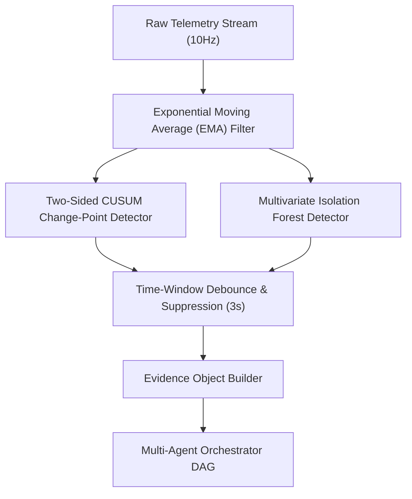

# ALLIGENT Evidence Layer & Anomaly Extraction

**Product:** ALLIGENT — AI-Powered Industrial Investigation & Decision Support  
**Document:** Statistical Change-Point Detection & Evidence Generation  
**Version:** 1.0.0  

---

## 1. Architectural Purpose

In continuous industrial monitoring, passing raw 10Hz sensor data (864,000 data points per channel per day) directly into Large Language Models or reasoning graphs is computationally prohibitive and prone to hallucination.

The **ALLIGENT Evidence Layer** acts as a rigorous **signal-to-symbol transduction boundary**. It continuously evaluates raw numerical telemetry, filters high-frequency noise, detects subtle parametric shifts, and emits structured, mathematically quantified `Evidence` objects to downstream diagnostic agents.



---

## 2. Statistical Change-Point Detection: Two-Sided CUSUM

To detect subtle mean shifts prior to catastrophic threshold violations, ALLIGENT implements a **Two-Sided Cumulative Sum (CUSUM)** algorithm across critical thermal and vibration channels.

### 2.1 Mathematical Formulation
For a continuous sensor sequence $x_1, x_2, \dots, x_n$ with baseline mean $\mu_0$ and baseline standard deviation $\sigma_0$:

The upper cumulative deviation $S_n^+$ (detecting sudden increases) and lower cumulative deviation $S_n^-$ (detecting sudden drops) are computed iteratively:

$$S_n^+ = \max\left(0, S_{n-1}^+ + \frac{x_n - \mu_0}{\sigma_0} - k\right)$$

$$S_n^- = \max\left(0, S_{n-1}^- - \frac{x_n - \mu_0}{\sigma_0} - k\right)$$

Where:
* $k$: The reference value / allowance slack parameter, typically configured as $k = 0.5$ (detecting shifts of size $1.0\sigma$).
* $h$: The decision interval threshold, set to $h = 4.5\sigma$.

### 2.2 Alarm Condition
An anomaly alarm triggers when either cumulative sum exceeds the decision threshold:

$$\text{Alarm}_n = \begin{cases} \text{High Shift Alarm}, & \text{if } S_n^+ > h \\ \text{Low Shift Alarm}, & \text{if } S_n^- > h \\ \text{Normal}, & \text{otherwise} \end{cases}$$

Upon triggering an alarm, the detector records the exact change-point index $\tau = \arg\min_i \{S_i^+ = 0\}$ to identify the precise moment of fault inception.

---

## 3. Multivariate Anomaly Scoring: Isolation Forest

While CUSUM operates on univariate time series, industrial faults often manifest as anomalous multi-parameter correlations (e.g., cutting force remaining low while spindle motor power spikes).

### 3.1 Algorithm Configuration
* **Algorithm:** `sklearn.ensemble.IsolationForest`
* **Features:** $\mathbf{z} = [P_{elec}, v_{rms}, T_{bearing}, v_f, P_{cool}]$
* **Parameters:**
  * `n_estimators = 100` trees
  * `contamination = 0.01` (1% expected abnormal state envelope)
  * `max_samples = 256`

### 3.2 Scoring Metric
The anomaly score $s(x, n)$ for an observation $x$ over a dataset of $n$ instances is:

$$s(x, n) = 2^{-\frac{\mathbb{E}(h(x))}{c(n)}}$$

Where $h(x)$ is the path length in an isolation tree, and $c(n)$ is the average path length of unsuccessful searches in a Binary Search Tree:

$$c(n) = 2 \ln(n - 1) + 0.5772156649 - \frac{2(n - 1)}{n}$$

When $s \to 1.0$ (short path length), the observation is marked as an anomalous outlier.

---

## 4. Evidence Object Schema

When either detector crosses its confidence boundary, it constructs an immutable `Evidence` object passed to the Orchestrator:

```json
{
  "evidence_id": "EV-2026-0925-0042",
  "timestamp": 1727254802.450,
  "detector": "CUSUM_TWO_SIDED",
  "parameter": "temperature",
  "observed_value": 78.6,
  "expected_baseline": 48.2,
  "standard_deviation": 1.84,
  "deviation_zscore": 16.52,
  "change_point_timestamp": 1727254788.100,
  "confidence": 0.985,
  "time_series_window": [
    {"t": -5.0, "val": 49.1},
    {"t": -4.0, "val": 52.4},
    {"t": -3.0, "val": 58.9},
    {"t": -2.0, "val": 67.2},
    {"t": -1.0, "val": 74.5},
    {"t": 0.0, "val": 78.6}
  ],
  "context": {
    "spindle_speed": 14200.0,
    "feed_rate": 1800.0,
    "coolant_pressure": 1.4
  }
}
```

---

## 5. False Positive Suppression & Debouncing

Industrial shop floors experience momentary transient spikes caused by hard material inclusions or power line fluctuations. To prevent alert fatigue:

1. **Windowed Debounce:** An anomaly must persist for at least 3 consecutive seconds (30 simulation ticks) before triggering an incident investigation.
2. **Transient Suppression:** Single-tick outliers ($>5\sigma$ lasting $\le 100\text{ms}$) are logged to telemetry history as `transient_noise` but do not trigger agent dispatch.
3. **Cool-down Guard:** Once an incident case is actively open for a given machine, duplicate triggers on the same parameter are grouped into the active case rather than spawning concurrent duplicate investigations.
