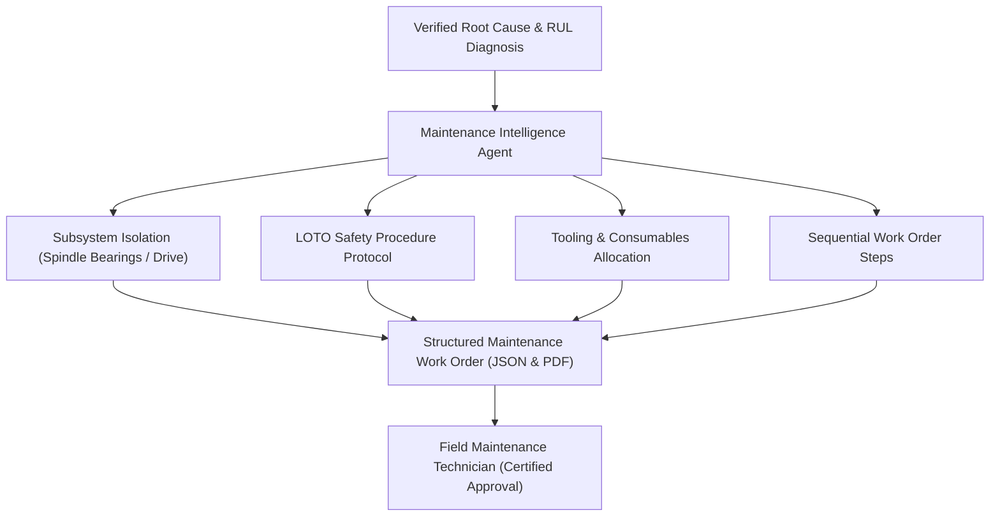

# ALLIGENT Maintenance Intelligence & Work Orders

**Product:** ALLIGENT — AI-Powered Industrial Investigation & Decision Support  
**Document:** Prescriptive Maintenance & LOTO Safety Procedures  
**Version:** 1.0.0  

---

## 1. Prescriptive Maintenance Overview

Diagnostic alarms are useless if technicians must spend hours reading electrical schematics to locate the fault.

**ALLIGENT Maintenance Intelligence** bridges diagnostic AI with field execution by automatically generating complete, safety-certified **Maintenance Work Orders (MWOs)**, precise **Lock-Out / Tag-Out (LOTO)** procedures, and required tooling lists upon incident confirmation.



---

## 2. Maintenance Work Order (MWO) Schema

Every generated work order adheres to standard industrial CMMS (Computerized Maintenance Management System) structures:

```json
{
  "work_order_id": "MWO-2026-0925-084",
  "incident_id": "INC-2026-0925-0042",
  "priority": "HIGH",
  "machine_id": "CNC-M04",
  "machine_name": "5-Axis High-Speed Milling Center M-04",
  "subsystem": "Front Spindle Bearing Assembly",
  "root_cause": "Angular Contact Bearing Raceways Spalling & Lubricant Starvation",
  "estimated_duration_hours": 3.5,
  "required_craft": [
    "Certified Mechanical Maintenance Technician (Level 2)",
    "Industrial Electrician (LOTO Sign-off)"
  ],
  "required_tooling": [
    "Bearing Induction Heater (Model IH-200)",
    "Dial Test Indicator with Magnetic Base (0.001mm resolution)",
    "Hydraulic Puller Set (5-ton capacity)",
    "Calibrated Torque Wrench (20 - 150 Nm)",
    "Class 1 Sound & Vibration Analyzer"
  ],
  "required_consumables": [
    "Matched Bearing Pair: SKF 7014 CD/P4ADGA (Qty: 1)",
    "Synthetic High-Speed Spindle Grease: Kluber Isoflex NBU 15 (50g)",
    "Fluoroelastomer O-Ring Spindle Seal Kit (Qty: 1)"
  ]
}
```

---

## 3. Lock-Out / Tag-Out (LOTO) Zero-Energy Safety Protocol

Safety regulations (OSHA 1910.147 / ISO 14118) mandate strict zero-energy state verification prior to any physical maintenance on rotating machinery. ALLIGENT automatically generates a machine-specific LOTO checklist:

| Step | Energy Source | Isolation Device / Location | Action Required | Verification Method |
| :--- | :--- | :--- | :--- | :--- |
| **01** | **Main 480V AC Electrical** | Main Disconnect Switch `DS-01` (Cabinet A) | Turn switch to `OFF`. Apply safety padlock and danger tag #4812. | Attempt spindle startup at operator panel; verify zero voltage on voltmeter across L1, L2, L3. |
| **02** | **Pneumatic Pressure** | Main Pneumatic Shut-off Valve `PV-03` | Rotate valve 90° to exhaust position. Apply lockout hasp. | Verify line pressure gauge reads `0.0 bar`. Actuate manual tool unclamp; confirm zero response. |
| **03** | **Coolant High Pressure** | Coolant Pump Breaker `CB-12` | Trip breaker to `OFF`. Apply breaker lockout lock. | Press manual coolant washdown switch; verify zero fluid flow. |
| **04** | **Gravitational / Kinetic** | Vertical Z-Axis Spindle Head | Insert mechanical axis safety locking pin `SP-01`. | Visually inspect mechanical positive pin engagement. |

---

## 4. Sequential Step-by-Step Maintenance Procedure

1. **Safety Preparation:** Complete all 4 steps of the LOTO checklist above. Obtain supervisor physical sign-off.
2. **Tooling & Enclosure Removal:** Unbolt the front spindle nose shroud using a 6mm hex key. Carefully disconnect internal thermocouple wiring harnesses.
3. **Extraction:** Mount hydraulic puller to spindle nose ring. Apply uniform tension until front bearing pack slips off the shaft seat. Inspect shaft journal for scoring or thermal discoloration.
4. **Cleaning & Inspection:** Clean the bearing housing cavity with approved lint-free solvent. Verify shaft runout is under $0.003\text{mm}$ using the dial test indicator.
5. **Induction Heating & Mounting:** Heat replacement matched bearing pair (`SKF 7014`) to exactly $105^\circ\text{C}$ on induction heater. Slide onto spindle shaft until fully seated against inner shoulder. Hold until cool.
6. **Lubrication:** Meter exactly $15\text{mL}$ of Kluber Isoflex NBU 15 grease uniformly across ball tracks using a graduated syringe. Do NOT over-grease.
7. **Reassembly & Seal Installation:** Replace front fluoroelastomer seals. Torque front retaining labyrinth flange bolts to $45\text{ Nm}$ in a cross-star pattern.

---

## 5. Post-Maintenance Commissioning & Run-in Cycle

To prevent premature failure of new precision bearings, the machine must execute a controlled **Run-In Velocity Ramp**:

* **Step 1:** $2,000\text{ RPM}$ for 15 minutes $\to$ verify bearing temperature stabilizes $< 32^\circ\text{C}$.
* **Step 2:** $5,000\text{ RPM}$ for 20 minutes $\to$ monitor vibration velocity RMS ($< 0.8\text{ mm/s}$).
* **Step 3:** $10,000\text{ RPM}$ for 20 minutes $\to$ verify thermal equilibrium ($< 45^\circ\text{C}$).
* **Step 4:** Maximum rated speed ($15,000\text{ RPM}$) for 15 minutes $\to$ sign off work order in ALLIGENT UI.
