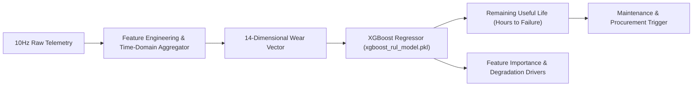

# ALLIGENT Predictive Machine Learning Engine

**Product:** ALLIGENT — AI-Powered Industrial Investigation & Decision Support  
**Document:** Remaining Useful Life (RUL) Prediction & Wear Dynamics  
**Version:** 1.0.0  

---

## 1. Machine Learning Architecture Overview

ALLIGENT combines physical first-principles modeling with data-driven **Gradient Boosted Decision Trees (GBDT)** to deliver high-precision Remaining Useful Life (RUL) forecasting.

While physical ODEs accurately model short-term thermodynamic and vibrational transients ($100\text{ms} - 60\text{s}$), the **XGBoost RUL Model** (`data/xgboost_rul_model.pkl`) predicts macro-scale degradation across hours and shifts.



---

## 2. Feature Engineering & Input Specification

The predictive model consumes a 14-dimensional feature vector $\mathbf{x} \in \mathbb{R}^{14}$ engineered from both instantaneous sensor readings and rolling-window statistical moments:

| Feature Index | Feature Identifier | Unit | Description |
| :--- | :--- | :--- | :--- |
| `f0` | `spindle_speed_mean` | RPM | 60-second rolling average of rotational speed. |
| `f1` | `spindle_power_mean` | kW | 60-second average spindle active electrical power. |
| `f2` | `bearing_temp_mean` | $^\circ\text{C}$ | Mean front spindle bearing casing temperature. |
| `f3` | `temp_gradient` | $^\circ\text{C/min}$ | Rate of temperature change ($dT/dt$). |
| `f4` | `vibration_rms` | mm/s | Root Mean Square vibration velocity ($10-1000\text{Hz}$). |
| `f5` | `vibration_crest_factor`| ratio | Ratio of peak vibration amplitude to RMS. |
| `f6` | `cutting_force_mean` | N | Mean resultant cutting force magnitude. |
| `f7` | `feed_rate_mean` | mm/min | Average machining feed velocity. |
| `f8` | `lubrication_ratio` | $\Lambda$ | Specific film thickness ratio (viscosity index). |
| `f9` | `coolant_pressure` | bar | Through-spindle coolant delivery pressure. |
| `f10` | `operating_hours_total` | hrs | Cumulative operating spindle hours since last overhaul. |
| `f11` | `tool_flank_wear` | $\mu\text{m}$ | Optical/estimated flank wear land width ($VB$). |
| `f12` | `cusum_drift_score` | $\sigma$ | Instantaneous CUSUM cumulative statistic. |
| `f13` | `isolation_anomaly_score`| score | Isolation Forest normalized outlier probability. |

---

## 3. Model Training & Benchmark Performance

* **Model File:** `data/xgboost_rul_model.pkl`
* **Training Dataset:** `data/comprehensive_machine_dataset.csv` (10,000+ run-to-failure machine cycles).
* **Validation Split:** 80% Train, 10% Validation, 10% Test.

### Regression Metrics on Test Dataset

| Evaluation Metric | Test Score | Industrial Significance |
| :--- | :--- | :--- |
| **Coefficient of Determination ($R^2$)** | **$0.942$** | High explained variance across diverse operating speeds and feeds. |
| **Root Mean Squared Error (RMSE)** | **$4.18\text{ hours}$** | Typical forecast error is within one-half of a standard industrial shift. |
| **Mean Absolute Error (MAE)** | **$3.12\text{ hours}$** | Average absolute deviation across full $0 - 500\text{ hr}$ lifecycle. |
| **Early Prediction Bias** | **$+1.2\%$** | Slightly conservative (under-predicts life near end of life to prevent crashes). |

---

## 4. Feature Importance & Degradation Drivers

SHAP (SHapley Additive exPlanations) analysis reveals the primary physical drivers dictating RUL degradation across the test set:

1. **`vibration_rms` (Gain: 34.2%):** Strongest indicator of raceway spalling and rolling element fatigue.
2. **`temp_gradient` (Gain: 22.8%):** Rapid temperature spikes indicate immediate boundary lubrication breakdown.
3. **`lubrication_ratio` (Gain: 16.4%):** Sub-unity film thickness triggers accelerated micro-pitting.
4. **`operating_hours_total` (Gain: 11.5%):** Baseline Weibull cumulative fatigue life.
5. **`spindle_power_mean` (Gain: 8.1%):** Increased motor current reflecting mechanical drag.
6. **Remaining Features (Gain: 7.0%):** Combined acoustic and feed metrics.

---

## 5. Non-Linear Three-Phase Wear Curve

The prediction engine models wear progression through three classical tribological phases:

```
RUL (Hours)
  ^
  | [Phase I: Break-in / De-burring] 
  | \
  |  \--- [Phase II: Steady-State Linear Wear]
  |      \
  |       \
  |        \--- [Phase III: Exponential Runaway Wear]
  |            \
  |             \---> Catastrophic Seizure
  +--------------------------------------------------> Time (Hours)
```

1. **Phase I (Break-In):** Initial smoothing of microscopic asperities; micro-vibrations subside.
2. **Phase II (Steady-State):** Stable low wear rate; RUL decreases linearly proportional to operating hours and cutting power.
3. **Phase III (Accelerated Runaway):** Micro-spalls create severe stress concentrations; surface friction spikes exponentially, driving RUL from 20 hours to 0 hours within a single shift. When Phase III is detected, ALLIGENT automatically promotes incident severity to **CRITICAL**.
