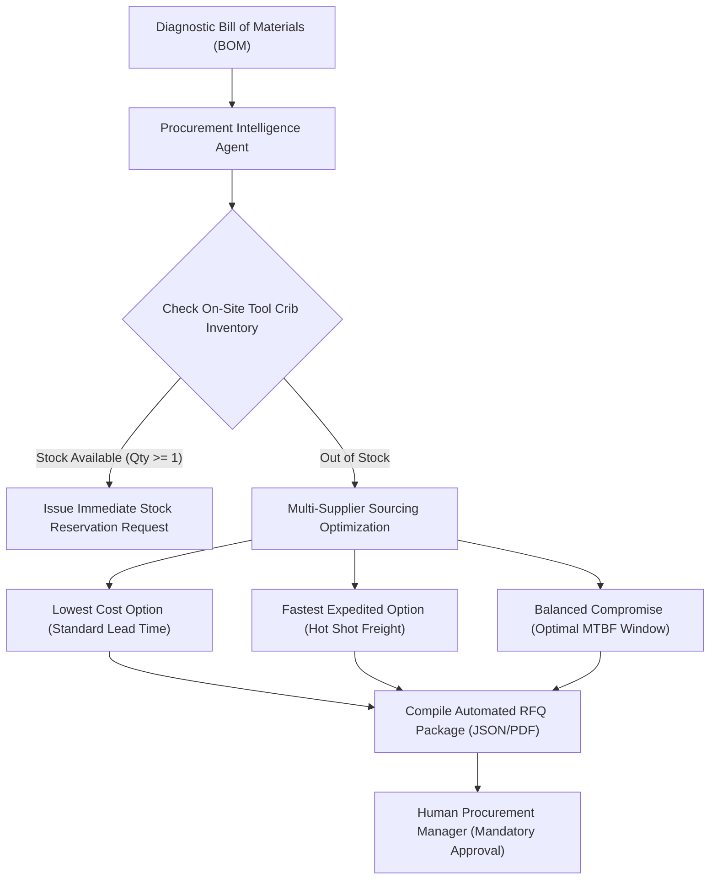

# ALLIGENT Procurement Intelligence & Inventory Sourcing

**Product:** ALLIGENT — AI-Powered Industrial Investigation & Decision Support  
**Document:** Spare Parts Optimization & Sourcing Intelligence  
**Version:** 1.0.0  

---

## 1. Notice Regarding Demonstration Data

> [!IMPORTANT]
> **DEMO PROCUREMENT DATA NOTICE:**  
> The supplier catalogs, unit price quotes, lead times, inventory counts, and distributor API responses described in this document and utilized within the ALLIGENT platform represent **synthesized demonstration data (`DEMO PROCUREMENT DATA`)**. In production deployments, these endpoints interface with live enterprise ERP systems (SAP S/4HANA, Oracle NetSuite, IBM Maximo) via the adapters described in [ROADMAP.md](file:///c:/Users/pn466/OneDrive/Documents/factorybrain/docs/ROADMAP.md).

---

## 2. Procurement Intelligence Architecture

When the Predictive Engine determines an impending machine component failure, the **Procurement Intelligence Agent** initiates automated sourcing analysis before the machine shuts down.



---

## 3. Sourcing Optimization & Trade-Off Matrix

When the required replacement component (e.g., `SKF 7014 CD/P4ADGA` Angular Contact Spindle Bearing) is depleted in the local plant tool crib, ALLIGENT queries external distributor catalogs:

| Supplier / Vendor | Tier / Type | Quoted Lead Time | Unit Price | Freight / Expedite Fee | Total Landed Cost | Risk Assessment |
| :--- | :--- | :--- | :--- | :--- | :--- | :--- |
| **Plant Tool Crib (Bay 4)** | Internal Stock | **0.5 hours** | \$0 (Pre-paid) | \$0 | **\$0** | **Preferred (Depleted)** |
| **Motion Industries (Regional)** | Tier 1 Auth. Distributor | **4.0 hours** (Courier) | \$680.00 | \$250.00 (Hot Shot) | **\$930.00** | **Best for Immediate Critical Fix** |
| **SKF Direct Factory Depo** | OEM Direct | **24.0 hours** (Air) | \$590.00 | \$85.00 (Next Day) | **\$675.00** | **Best for Planned Weekend Shift** |
| **Applied Industrial Tech** | Tier 1 Distributor | **48.0 hours** (Ground) | \$540.00 | \$25.00 (Standard) | **\$565.00** | **Lowest Cost / High Downtime Risk**|

---

## 4. Part Cross-Referencing & Interchangeability

To prevent extended line stoppages when exact OEM part numbers are globally back-ordered, the Procurement Agent maintains a precision cross-reference equivalence engine:

| Primary Spec | Equivalent Alternative 1 | Equivalent Alternative 2 | ABEC / Precision Tolerance | Contact Angle | Dynamic Load Rating |
| :--- | :--- | :--- | :--- | :--- | :--- |
| **SKF 7014 CD/P4ADGA** | **FAG B7014-C-T-P4S** | **NSK 7014CTYNDBLP4** | ISO Class 4 / ABEC-7 | 15° ($C$) | $42.5\text{ kN}$ |
| **Kluber Isoflex NBU 15** | **Fuchs Renolit HVI 2** | **Mobil Velocite No. 6** | High-Speed Synthetic | N/A | Speed Factor $d_m \cdot n > 1.2 \times 10^6$ |

---

## 5. Automated Request for Quotation (RFQ) Schema

The agent generates a structured RFQ payload ready for automated submission to electronic EDI / REST supplier interfaces upon human procurement authorization:

```json
{
  "rfq_id": "RFQ-2026-0925-104",
  "incident_reference": "INC-2026-0925-0042",
  "machine_id": "CNC-M04",
  "urgency_level": "EXPEDITED_LINE_DOWN",
  "demanded_delivery_deadline": "2026-09-25T18:00:00Z",
  "line_items": [
    {
      "item_id": 1,
      "primary_part_number": "SKF 7014 CD/P4ADGA",
      "acceptable_alternatives": ["FAG B7014-C-T-P4S", "NSK 7014CTYNDBLP4"],
      "quantity": 1,
      "unit_of_measure": "EA",
      "required_certificate": "Certificate of Conformance (EN 10204 3.1)"
    },
    {
      "item_id": 2,
      "primary_part_number": "KLUBER-NBU-15-50G",
      "acceptable_alternatives": ["FUCHS-HVI-2-50G"],
      "quantity": 1,
      "unit_of_measure": "TUBE",
      "required_certificate": "Safety Data Sheet (SDS)"
    }
  ],
  "delivery_address": {
    "facility": "Plant 02 - Precision Machining Bay",
    "dock": "Receiving Dock C (Express Courier)",
    "attention": "Lead Mechanical Maintenance Supervisor"
  }
}
```
