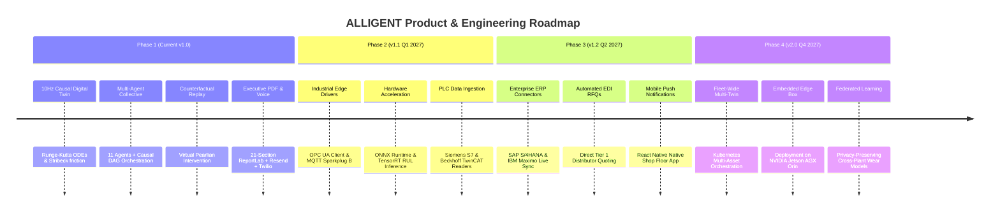

# ALLIGENT Engineering Roadmap

**Product:** ALLIGENT — AI-Powered Industrial Investigation & Decision Support  
**Document:** Product Roadmap & Future Engineering Milestones  
**Version:** 1.0.0  

---

## 1. Roadmap Architecture

The ALLIGENT platform is evolving across four planned engineering phases to transition from high-fidelity digital twin simulation to direct enterprise deployment on physical shop floors.

---

## 2. Detailed Milestone Specifications

### Milestone 1: Core Platform & Decision Support (Current v1.0)
* **Status:** `IMPLEMENTED` & Verified.
* Deterministic 10Hz physical digital twin with dynamic parameter modulation.
* 11-Agent collective with Pydantic v2 schema enforcement.
* Counterfactual replay engine with delta convergence verification.
* Automated 21-section publication-grade PDF report compiler.
* Action-oriented executive email dispatch and automated Twilio voice phone escalation.

### Milestone 2: Industrial Edge Ingestion (v1.1 — Q1 2027)
* **Goal:** Direct ingestion from physical CNC machines and industrial PLC networks.
* **OPC UA Ingestion Driver:** Native asynchronous client utilizing `asyncua`, mapping industrial node IDs to the `TelemetryRecord` schema.
* **MQTT / Sparkplug B Support:** High-efficiency binary telemetry streaming over shop floor MQTT brokers.
* **Direct PLC Connectors:** Read-only data adapters for Siemens S7 (`snap7`), Beckhoff TwinCAT (ADS protocol), and Rockwell ControlLogix (EtherNet/IP).

### Milestone 3: Enterprise Asset Management & ERP Live Sync (v1.2 — Q2 2027)
* **Goal:** Transition from seeded demonstration procurement to live transactional enterprise systems.
* **SAP S/4HANA Connector:** Bi-directional OData REST client creating formal maintenance notifications (`IW21`) and work orders (`IW31`).
* **IBM Maximo EAM Sync:** Automated spare parts inventory reservations and LOTO checklist import.
* **Automated RFQ Dispatch:** Direct integration with industrial suppliers (Motion Industries, McMaster-Carr) via cXML and EDI protocols.

### Milestone 4: Distributed Fleet Intelligence & Edge Hardware (v2.0 — Q4 2027)
* **Goal:** Factory-wide and cross-plant autonomous coordination.
* **Multi-Twin Orchestrator:** Scalable Kubernetes microservices orchestrating 500+ concurrent machine twins via Redis streams.
* **Embedded Edge Gateway:** Containerized deployment on ruggedized **NVIDIA Jetson AGX Orin** industrial PCs directly inside machine electrical cabinets.
* **Federated RUL Transfer Learning:** Privacy-preserving federated machine learning training across distributed manufacturing plants.
