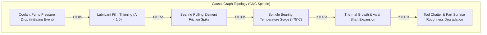

# ALLIGENT Causal Root Cause Engine

**Product:** ALLIGENT — AI-Powered Industrial Investigation & Decision Support  
**Document:** Causal Inference Formulation & Hypothesis Scoring  
**Version:** 1.0.0  

---

## 1. Principles of Causal Diagnosis in Industrial Machinery

Machine faults rarely occur in isolation. A rise in spindle bearing temperature may be caused by lubrication starvation, excessive preload, unbalance vibration, or an electrical motor overload. Standard correlation-based AI models frequently mistake downstream symptoms (e.g., surface chatter on the workpiece) for root causes (e.g., thermal spindle growth reducing bearing clearance).

ALLIGENT combines **Causal Directed Acyclic Graphs (DAGs)** with **Pearl's do-calculus intervention principles** to isolate true initiating root causes from cascading secondary effects.

---

## 2. Hypothesis Generation & Causal DAG Traversal

When the Evidence Layer triggers an investigation, the Causal Engine constructs candidate hypotheses $\{H_1, H_2, \dots, H_m\}$ from the findings of the 7 Domain Specialists.

The engine evaluates each hypothesis against the **spindle causal adjacency matrix** $\mathbf{A}_{causal}$, where entry $A_{ij} \ne 0$ indicates a verified physical relationship with propagation latency $\tau_{ij}$.

### Initiating Cause vs. Downstream Symptom
A node $H_k$ is classified as a candidate root cause if:
1. It has an in-degree of zero among the anomalous nodes observed in the current time window, OR
2. Its anomaly change-point timestamp $t_{change}(H_k)$ strictly precedes all downstream effects:
   $$t_{change}(H_k) \le \min_{j \in \text{Children}(H_k)} t_{change}(j) - \tau_{kj}$$

---

## 3. Mathematical Scoring Formulation

Each candidate hypothesis $H_i$ is evaluated using a multi-factor scoring function combining statistical likelihood, temporal sequence, digital twin counterfactual support, and thermodynamic consistency:

$$S(H_i) = w_1 \cdot \mathcal{L}(E \mid H_i) + w_2 \cdot \mathcal{T}(H_i, E) + w_3 \cdot \mathcal{C}(H_i) + w_4 \cdot \Phi(H_i)$$

Where the weights satisfy $\sum_{k=1}^4 w_k = 1.0$ (calibrated as $w_1 = 0.35, w_2 = 0.25, w_3 = 0.25, w_4 = 0.15$):

### 3.1 Likelihood Score $\mathcal{L}(E \mid H_i)$
The conditional probability of observing the evidence vector $E$ given the fault hypothesis $H_i$, calculated using empirical likelihood profiles:

$$\mathcal{L}(E \mid H_i) = \exp\left(-\frac{1}{2} (\mathbf{z}_E - \boldsymbol{\mu}_{H_i})^T \boldsymbol{\Sigma}_{H_i}^{-1} (\mathbf{z}_E - \boldsymbol{\mu}_{H_i})\right)$$

### 3.2 Temporal Precedence Metric $\mathcal{T}(H_i, E)$
Measures how well the observed sequence of sensor alarms matches the theoretical causal propagation delay $\tau_{expected}$:

$$\mathcal{T}(H_i, E) = \max\left(0, 1.0 - \frac{|(t_{observed\_effect} - t_{observed\_cause}) - \tau_{expected}|}{3 \cdot \sigma_\tau}\right)$$

### 3.3 Counterfactual Verification Support $\mathcal{C}(H_i)$
The metric returned by the Counterfactual Replay Engine (see [COUNTERFACTUAL_REPLAY.md](file:///c:/Users/pn466/OneDrive/Documents/factorybrain/docs/COUNTERFACTUAL_REPLAY.md)). If neutralizing $H_i$ in the simulated digital twin eliminates the anomaly, $\mathcal{C}(H_i) \to 1.0$; if the anomaly persists, $\mathcal{C}(H_i) \to 0.0$.

### 3.4 Physical Consistency $\Phi(H_i)$
Evaluates whether the hypothesis violates conservation of energy or mechanical limits:
$$\Phi(H_i) = \begin{cases} 1.0, & \text{if } Q_{gen}(H_i) \ge C_{thermal} \Delta T / \Delta t \\ 0.2, & \text{if thermally unviable} \end{cases}$$

---

## 4. Normalization & Confidence Calibration

Raw scores are normalized across all $m$ candidate hypotheses using a softmax transformation with temperature parameter $T = 0.8$:

$$P(H_i \mid E) = \frac{\exp(S(H_i) / T)}{\sum_{j=1}^m \exp(S(H_j) / T)}$$

### Escalation Thresholds
* **Critical Automated Escalation:** $P(H_{top} \mid E) \ge 0.85$ and $\mathcal{C}(H_{top}) \ge 0.80$. Triggers executive email dispatch and automated Twilio voice phone call.
* **Advisory Warning:** $0.65 \le P(H_{top} \mid E) < 0.85$. Highlights on dashboard HUD; logs maintenance recommendation.
* **Inconclusive Investigation:** $P(H_{top} \mid E) < 0.65$. Flags incident as ambiguous; requests manual vibration analyst inspection.
