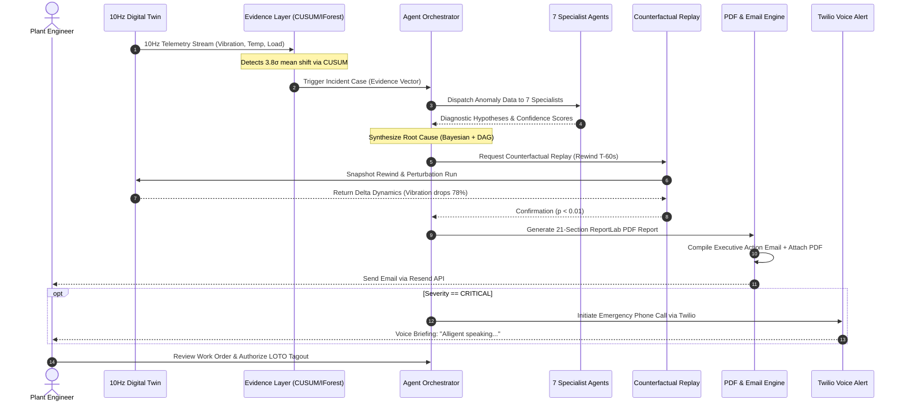

# ALLIGENT End-to-End System & Incident Flow

**Product:** ALLIGENT — AI-Powered Industrial Investigation & Decision Support  
**Document:** Operational Workflow & Incident Progression  
**Version:** 1.0.0  

---

## 1. Overview of Incident Lifecycle

The lifecycle of an industrial incident within ALLIGENT spans **seven discrete operational phases**, progressing from high-frequency sub-millisecond sensor acquisition through multi-agent causal evaluation to executive communication and human-in-the-loop maintenance closure.

---

## 2. Detailed Phase Progression

### Phase 1: Anomaly Inception & Continuous Telemetry (0.0s – 1.5s)
1. **Continuous Acquisition:** The digital twin or machine edge gateway streams 10-dimensional telemetry vectors at 10Hz over WebSocket to the backend.
2. **Statistical Trigger:** The CUSUM statistical change-point detector registers cumulative deviations exceeding the $h = 5\sigma$ threshold on front spindle bearing temperature ($T_{bearing} > 78.5^\circ\text{C}$, $dT/dt > 0.42^\circ\text{C/s}$).
3. **ML Correlation:** Simultaneously, the Isolation Forest model flags a multivariate outlier score of $-0.74$ across combined feed rate, spindle power, and radial vibration RMS ($v_{rms} > 4.8\text{ mm/s}$).
4. **Evidence Construction:** The ingestion layer constructs an immutable `Evidence` payload containing raw sensor readings, standard deviations, baseline deviations, and timestamp stamps.

### Phase 2: Orchestration & Specialist Dispatch (1.5s – 4.0s)
1. **Incident Case Initialization:** The `CaseManager` creates an incident document in MongoDB (`INC-2026-XXXX`) with status `INVESTIGATING`.
2. **Specialist Fan-Out:** The `AgentOrchestrator` distributes the evidence vector concurrently to 7 domain specialist agents:
   * **Acoustic Specialist:** Performs FFT harmonic breakdown, isolating bearing outer race defect frequency (BPFO).
   * **Thermal Specialist:** Evaluates heat dissipation gradient ($Q_{gen}$ vs. $Q_{diss}$) across spindle casing.
   * **Lubrication Specialist:** Calculates dynamic oil film thickness and hydrodynamic starvation risk.
   * **Tool Wear Specialist:** Assesses Taylor tool wear index ($V \cdot T^n = C$) and cutting edge dulling.
   * **Electrical Specialist:** Checks motor current signature (MCSA) for phase imbalance or torque ripple.
   * **Quality Specialist:** Predicts surface roughness degradation ($R_a > 1.6\mu\text{m}$) and dimensional drift.
   * **Structural Dynamics Specialist:** Evaluates machine bed resonance, natural frequencies, and structural looseness.

### Phase 3: Root Cause Synthesis (4.0s – 6.5s)
1. **Hypothesis Cross-Correlation:** The Orchestrator aggregates specialist outputs, filtering out secondary symptoms.
2. **Bayesian Scoring:** Hypotheses are scored using a weighted multi-factor formulation:
   $$S(H_i) = w_1 \cdot \text{Likelihood}(E | H_i) + w_2 \cdot \text{TemporalPrecedence} + w_3 \cdot \text{PhysicsConsistency}$$
3. **Primary Diagnosis Selection:** The top-ranked hypothesis is selected (e.g., *Front Bearing Lubrication Starvation & Spalling* with confidence $0.92$).

### Phase 4: Counterfactual Verification Replay (6.5s – 8.5s)
1. **Digital Twin Rewind:** The `CounterfactualVerifier` calls `twin.snapshot()` to capture current state, then rewinds the simulation state vector to $T - 60.0\text{ seconds}$ before the anomaly manifested.
2. **Parameter Perturbation:** The simulator injects a counterfactual fix (e.g., restoring nominal lubricant injection flow rate to $3.5\text{ mL/min}$ and reducing spindle RPM by 25%).
3. **Delta Evaluation:** The simulation runs forward 600 ticks (60s). The engine measures the residual vibration and thermal expansion:
   * If the anomaly does not manifest in the counterfactual run, the causal hypothesis is **Verified**.
   * If the anomaly still manifests, the hypothesis is **Rejected**, triggering secondary hypothesis evaluation.

### Phase 5: Predictive Risk & What-If Projection (8.5s – 10.0s)
1. **Wear & RUL Inference:** The feature vector is passed to the trained XGBoost model (`data/xgboost_rul_model.pkl`), calculating Remaining Useful Life ($RUL \approx 14.2\text{ hours}$ before catastrophic seizure).
2. **Secondary Failure Cascade:** The What-If engine computes probabilities of collateral damage:
   * Tool shank fracture: $84\%$ probability within 4 hours.
   * Spindle motor stator thermal burn: $62\%$ probability within 8 hours.

### Phase 6: Enterprise Dispatch & Executive Communication (10.0s – 13.0s)
1. **21-Section ReportLab PDF Generation:** The PDF engine dynamically builds an exhaustive engineering report (~230KB) containing:
   * Executive summary and financial risk exposure (\$48,500 estimated downtime loss).
   * High-resolution telemetry charts and FFT spectrum graphs.
   * Bill of Materials (BOM) replacement parts table.
   * Lock-Out / Tag-Out (LOTO) safety protocol checklist.
2. **Executive Email Dispatch:** The `EmailAlert` engine contacts the Resend REST API, delivering an action-oriented executive email to the designated plant supervisor with the 21-section PDF attached.
3. **Emergency Voice Escalation:** If severity is `CRITICAL`, the `TwilioAlert` engine places an automated telephone call to the designated on-call engineer, audibly synthesizing:
   > *"Hello Prajwal. Alligent speaking, this machine is facing an abnormal bearing condition, please look after it immediately."*

### Phase 7: Human Authorization & Maintenance Closure (Operator Loop)
1. **Decision Console:** The plant engineer reviews the executive briefing on the desktop web console or mobile gateway.
2. **Authorization Sign-Off:** The engineer approves the containment plan (Spindle speed derate to 60%, coolant override, maintenance dispatch).
3. **Execution & Reset:** Certified technicians execute the physical repair; the operator clears the incident flag in the UI, and the digital twin resumes baseline monitoring.
