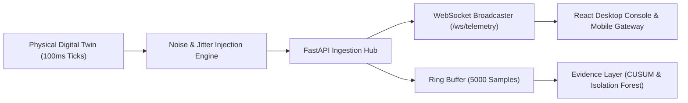

# ALLIGENT Telemetry Stream & Protocol Specification

**Product:** ALLIGENT — AI-Powered Industrial Investigation & Decision Support  
**Document:** Telemetry Data Pipeline & WebSocket Protocol  
**Version:** 1.0.0  

---

## 1. High-Frequency Telemetry Pipeline

Industrial rotating machinery generates high-frequency mechanical and thermal transients. ALLIGENT deploys an asynchronous, low-latency telemetry pipeline operating at a deterministic **10Hz tick rate** ($100\text{ms}$ per packet).



---

## 2. Telemetry Packet Schema

Every telemetry packet emitted over WebSocket or ingested via REST conforms to the strongly validated JSON schema below:

```json
{
  "timestamp": 1727254800.105,
  "machine_id": "CNC-M04",
  "line_id": "LINE-02",
  "spindle_speed": 12450.0,
  "spindle_power": 8.75,
  "temperature": 52.4,
  "ambient_temp": 22.1,
  "vibration": 1.45,
  "cutting_force": 420.0,
  "feed_rate": 1800.0,
  "coolant_pressure": 5.8,
  "lubrication_ratio": 2.4,
  "tool_wear": 45.2,
  "anomaly_flag": false,
  "anomaly_score": 0.082
}
```

### 2.1 Field Definitions & Physical Specifications

| Field Name | Type | Unit | Accuracy / Resolution | Description |
| :--- | :--- | :--- | :--- | :--- |
| `timestamp` | `float` | Unix Epoch (s) | Millisecond ($\pm 1\text{ms}$) | Packet creation time in UTC seconds. |
| `machine_id` | `string` | ID string | Fixed Identifier | Unique physical machine code (e.g., `CNC-M04`). |
| `line_id` | `string` | ID string | Fixed Identifier | Production line identifier. |
| `spindle_speed` | `float` | RPM | $\pm 5\text{ RPM}$ | Main spindle rotational frequency. |
| `spindle_power` | `float` | kW | $\pm 0.05\text{ kW}$ | 3-phase spindle motor active power. |
| `temperature` | `float` | $^\circ\text{C}$ | $\pm 0.1^\circ\text{C}$ | Front duplex bearing casing temperature. |
| `ambient_temp` | `float` | $^\circ\text{C}$ | $\pm 0.2^\circ\text{C}$ | Machine shop ambient air temperature. |
| `vibration` | `float` | mm/s | $\pm 0.01\text{ mm/s}$ | Overall broadband vibration velocity RMS ($10 - 1000\text{Hz}$). |
| `cutting_force` | `float` | N | $\pm 5\text{ N}$ | Resultant dynamic cutting force on tool tip. |
| `feed_rate` | `float` | mm/min | $\pm 1\text{ mm/min}$ | Axis table linear feed velocity. |
| `coolant_pressure`| `float` | bar | $\pm 0.05\text{ bar}$ | Spindle through-tool coolant fluid pressure. |
| `lubrication_ratio`| `float` | $\Lambda$ | $\pm 0.02$ | Minimum oil film thickness to composite surface roughness ratio. |
| `tool_wear` | `float` | $\mu\text{m}$ | $\pm 1.0\mu\text{m}$ | Flank wear land width ($VB$) on active cutting insert. |
| `anomaly_flag` | `bool` | Boolean | Exact | Flag set by real-time change-point detectors. |
| `anomaly_score` | `float` | Score ($0-1$) | Normalized | Composite anomaly metric generated by Isolation Forest. |

---

## 3. Sensor Noise & Quantization Modeling

In real industrial environments, raw transducer data contains electrical ripple, ADC quantization errors, and thermal sensor drift. ALLIGENT injects realistic noise characteristics into each simulated sensor channel:

$$\tilde{y}(t) = y(t) + \epsilon_{gaussian} + \epsilon_{quantization}$$

Where:
* $\epsilon_{gaussian} \sim \mathcal{N}(0, \sigma_{sensor}^2)$: Zero-mean Gaussian sensor noise.
  * Temperature: $\sigma_T = 0.15^\circ\text{C}$
  * Vibration: $\sigma_v = 0.04\text{ mm/s}$
  * Spindle Power: $\sigma_P = 0.08\text{ kW}$
* $\epsilon_{quantization} = \text{round}(y / q) \cdot q - y$: 16-bit analog-to-digital converter quantization with quantization step $q$.

---

## 4. WebSocket Streaming Protocol (`/ws/telemetry`)

The primary streaming interface connects web dashboards, 3D digital twins, and edge nodes to the backend via persistent WebSockets:

* **Endpoint:** `ws://<host>:8000/ws/telemetry`
* **Heartbeat & Keepalive:** The server sends a telemetry frame every $100\text{ms}$. If no client ping or acknowledgment is received within 30 seconds, the connection terminates gracefully.
* **Payload Encoding:** UTF-8 JSON.
* **Backpressure Management:** If client network buffers fill, the server drops historical frames and dispatches only the latest state vector, prioritizing zero latency over historical replay.

---

## 5. Ingestion & Parameter Modulation Endpoints

### 5.1 Real-Time Parameter Modulation (`POST /parameters/batch`)
Used by the Mobile Gateway and test harnesses to inject physical variations or operational overrides into the live twin:

* **Request Format:**
```json
{
  "spindle_speed": 16500.0,
  "coolant_pressure": 1.8,
  "feed_rate": 2800.0
}
```
* **Response:**
```json
{
  "status": "success",
  "applied_overrides": ["spindle_speed", "coolant_pressure", "feed_rate"],
  "timestamp": 1727254805.210
}
```

### 5.2 Reset Overrides (`POST /parameters/reset`)
Clears all active manual overrides in `twin._manual_overrides` and restores nominal closed-loop PID control:
* **Response:** `{"status": "reset", "message": "All manual overrides cleared"}`
