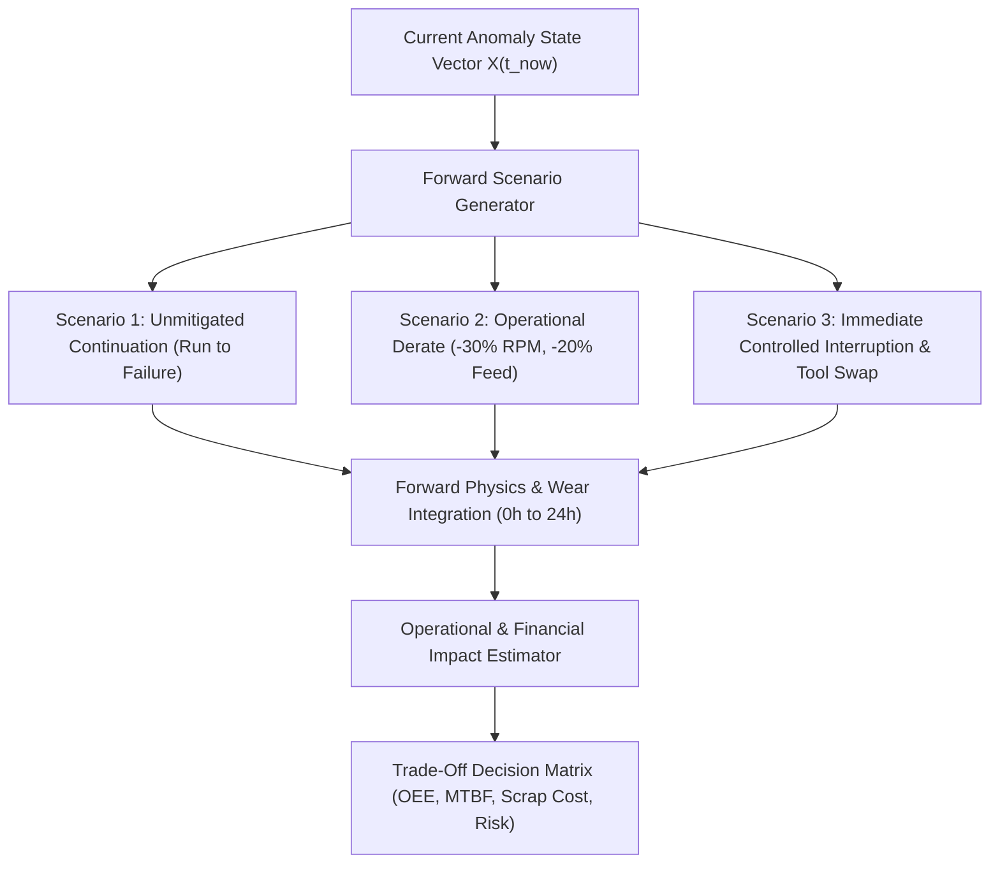

# ALLIGENT What-If Forward Simulation Engine

**Product:** ALLIGENT — AI-Powered Industrial Investigation & Decision Support  
**Document:** Forward Risk Projection & Operational Trade-Off Simulation  
**Version:** 1.0.0  

---

## 1. Overview of Forward What-If Modeling

When an industrial machine exhibits abnormal telemetry, maintenance and plant managers face critical operational decisions:
* *Can the machine complete the current production batch before emergency shutdown?*
* *If we derate spindle speed by 25%, how many additional operating hours do we gain?*
* *What is the financial risk of running to failure versus initiating an unscheduled tool change right now?*

The **ALLIGENT What-If Simulation Engine** answers these questions by simulating multiple forward operating scenarios from the current machine state using a combination of physics differential equations and Monte Carlo uncertainty modeling.

---

## 2. Standardized Comparison Scenarios

### Scenario 1: Unmitigated Continuation (Status Quo)
* **Operating Regime:** Maintain programmed speed ($14,500\text{ RPM}$) and cutting feed ($2,200\text{ mm/min}$) without intervention.
* **Failure Dynamics:** Thermal expansion accelerates bearing raceway spalling; lubricant completely breaks down ($\Lambda < 0.6$).
* **Predicted Trajectory:** Catastrophic bearing seizure within $3.4\text{ hours}$. High probability ($92\%$) of collateral motor stator burnout and spindle shaft distortion.

### Scenario 2: Operational Derate (Controlled Production)
* **Operating Regime:** Derate spindle RPM by 35% ($9,400\text{ RPM}$), reduce cutting feed by 20% ($1,760\text{ mm/min}$), and boost external coolant delivery to maximum flow.
* **Failure Dynamics:** Operating temperature plateaus below the glass transition point ($58^\circ\text{C}$); vibration stabilizes within ISO Class B acceptable zone.
* **Predicted Trajectory:** Extends Remaining Useful Life by $+18.6\text{ operating hours}$, enabling completion of the active production shift before planned maintenance.

### Scenario 3: Immediate Controlled Interruption
* **Operating Regime:** Orderly spindle ramp-down, workpiece unclamp, and immediate Lock-Out / Tag-Out (LOTO) isolation.
* **Failure Dynamics:** Zero progression of physical mechanical damage.
* **Predicted Trajectory:** Prevents all collateral damage; component replacement limited strictly to consumable insert and lubrication filter ($1.5\text{ hour}$ repair time).

---

## 3. KPI Impact & Financial Risk Projection

For each simulated scenario, the engine calculates operational KPIs and financial exposure:

| Operational Metric | Baseline Healthy | Scenario 1 (Run to Failure) | Scenario 2 (Derate) | Scenario 3 (Immediate Stop) |
| :--- | :--- | :--- | :--- | :--- |
| **Projected MTBF** | $2,400\text{ hrs}$ | $3.4\text{ hrs}$ | $420\text{ hrs}$ | Restores to $2,400\text{ hrs}$ post-repair |
| **Availability ($A$)** | $96.5\%$ | $0.0\%\text{ (Major Downtime)}$ | $94.0\%$ | $88.0\%\text{ (1.5h Planned Swap)}$ |
| **Performance ($P$)**| $98.0\%$ | $100\%\text{ (Until Crash)}$ | $68.0\%$ | $0.0\%\text{ (During Repair)}$ |
| **Quality ($Q$)** | $99.8\%$ | $62.0\%\text{ (Severe Chatter)}$ | $97.2\%$ | $100\%$ |
| **Overall OEE** | **$94.3\%$** | **$0.0\%$** | **$62.1\%$** | **$88.0\%$ (Shift Avg)** |
| **Direct Repair Cost** | $\$0$ | $\$38,500\text{ (Spindle Rebuild)}$ | $\$2,200\text{ (Bearing Pack)}$ | $\$450\text{ (Tool & Oil Refill)}$ |
| **Downtime Losses** | $\$0$ | $\$45,000\text{ (36h Unplanned)}$| $\$4,800\text{ (Reduced Throughput)}$ | $\$2,500\text{ (1.5h Scheduled)}$ |
| **Total Cost Exposure**| **$\$0$** | **$\$83,500$** | **$\$7,000$** | **$\$2,950$** |

---

## 4. Monte Carlo Parameter Uncertainty

Physical material variations, tool sharpness variance, and ambient fluctuations introduce uncertainty into wear projections. The engine conducts **500 Monte Carlo runs** per scenario by sampling key parameters:

$$k_{wear} \sim \text{LogNormal}(\mu_{wear}, \sigma_{wear}^2), \quad T_{ambient} \sim \mathcal{N}(22^\circ\text{C}, 1.5^\circ\text{C})$$

The resulting outputs yield **$95\%$ Confidence Intervals** for time-to-failure ($TTF_{95\%} = [2.8\text{h}, 4.1\text{h}]$ under Scenario 1), which are rendered directly into the generated PDF engineering reports.
